# Relatório de Execução de Testes — Issue #23

## 1. Identificação

**Issue:** #23 — Definir estrutura de pastas e criar componentes base  
**Responsável pelo desenvolvimento:** Márcio  
**Responsável pelos testes:** Lizandra  
**Branch testada:** `featureissue-32-criar-pastas-e-componentes`   
**Data da execução:** 24/09/2026
**Status geral:** Em execução

## 2. Objetivo

Validar a implementação dos componentes base do frontend,
verificando sua renderização, funcionamento, documentação
das propriedades (props) e inicialização da aplicação.

A validação será realizada com base nos critérios de
aceitação definidos na issue #23.

## 3. Ambiente de Testes

| Item | Configuração |
|---|---|
| Sistema operacional | Windows |
| Framework | React |
| Ferramenta de desenvolvimento | Vite 8.3.0 |
| Gerenciador de pacotes | npm |
| Versão do npm | 10.9.3 |
| Navegador | Brave |
| Ambiente | Local |
| Endereço | http://localhost:5173/ |

### 3.1 Preparação do ambiente

A implementação foi obtida a partir da branch vinculada
à issue #23.

Comandos utilizados:

```bash
git fetch origin
git switch --detach origin/featureissue-32-criar-pastas-e-componentes
cd frontend
npm install
npm run dev
```

O comando `git switch --detach` permite testar a versão
remota sem modificar a branch de trabalho do QA.

Para garantir a rastreabilidade, registrar o hash do
commit testado:

```bash
git rev-parse HEAD
```

**Observação:** o hash deverá ser registrado antes de
qualquer atualização da versão utilizada nos testes.

## 4. Critérios de Aceitação

Os critérios de aceitação estabelecidos na issue são:

- CA-01: Os componentes devem renderizar corretamente
  em uma página de teste.
- CA-02: As props devem estar documentadas e possuir
  valores padrão definidos.
- CA-03: O comando `npm run dev` deve executar sem erros.

Os identificadores CA-01, CA-02 e CA-03 foram criados
neste relatório para facilitar a rastreabilidade.

## 5. Casos de Teste

### QA-023-01 — Inicialização do frontend

**Critério:** CA-03  
**Tipo:** Teste de instalação e inicialização

**Pré-condições:**
- Node.js e npm instalados.
- Repositório disponível localmente.
- Branch correta selecionada.

**Passos:**
1. Acessar a branch correspondente à implementação.
2. Abrir o terminal na pasta `frontend`.
3. Executar `npm install`.
4. Verificar se a instalação termina sem erros.
5. Executar `npm run dev`.
6. Verificar a saída do terminal.
7. Acessar o endereço informado pelo Vite.
8. Verificar se a aplicação carrega no navegador.

**Resultado esperado:**
As dependências devem ser instaladas corretamente.
O Vite deve iniciar sem erros e disponibilizar
a aplicação no navegador.

**Resultado obtido:**
O comando `npm install` foi executado com sucesso,
adicionando 156 pacotes e sem identificar
vulnerabilidades na auditoria apresentada.

O Vite 8.3.0 iniciou normalmente e disponibilizou
a aplicação em `http://localhost:5173/`.

A página de testes carregou corretamente.

**Status:** Aprovado

**Evidências:**

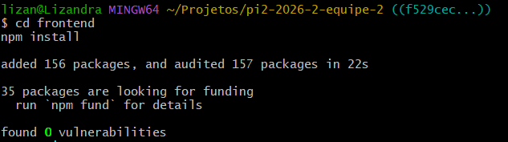

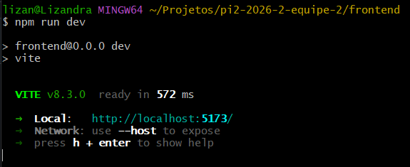

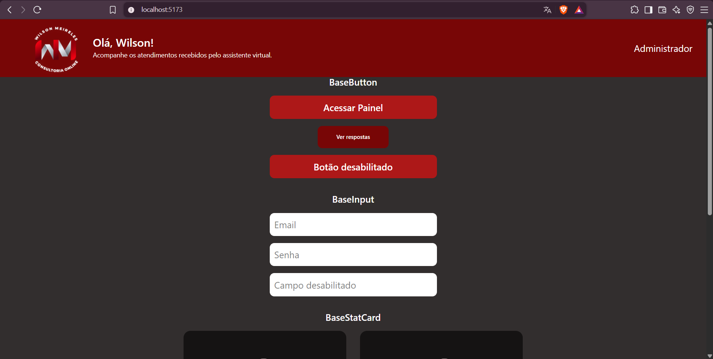

**Observações:**
Não foram identificados erros durante a inicialização.

---

### QA-023-02 — Renderização dos componentes

**Critério:** CA-01  
**Tipo:** Interface

**Pré-condições:**
- Frontend iniciado.
- Página de testes disponível.

**Passos:**
1. Acessar `http://localhost:5173/`.
2. Verificar a exibição do BaseHeader.
3. Verificar a exibição do BaseButton.
4. Verificar a exibição do BaseInput.
5. Verificar a exibição do BaseStatCard.
6. Verificar a exibição do BaseClientCard.
7. Observar possíveis erros visuais.
8. Verificar se existem erros no console do navegador.

**Resultado esperado:**
Todos os componentes devem renderizar corretamente,
sem falhas visuais ou erros de renderização.

**Resultado obtido:**

Os cinco componentes (BaseHeader, BaseButton, BaseInput,
BaseStatCard e BaseClientCard) foram renderizados
na página de testes.

Não foram observados erros de execução no console
durante a verificação inicial.

Entretanto, o Chrome DevTools identificou três
campos de formulário sem os atributos `id` ou `name`,
o que pode prejudicar o preenchimento automático.

**Status:** Aprovado com observação

**Observação:**
Investigar os avisos identificados no Chrome DevTools
durante o teste específico do componente BaseInput.

**Status:** Aprovado com observação

**Evidências:**

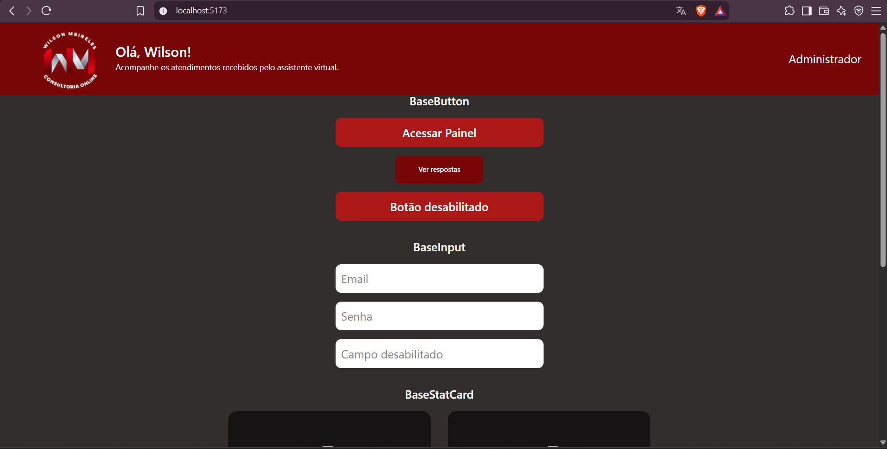

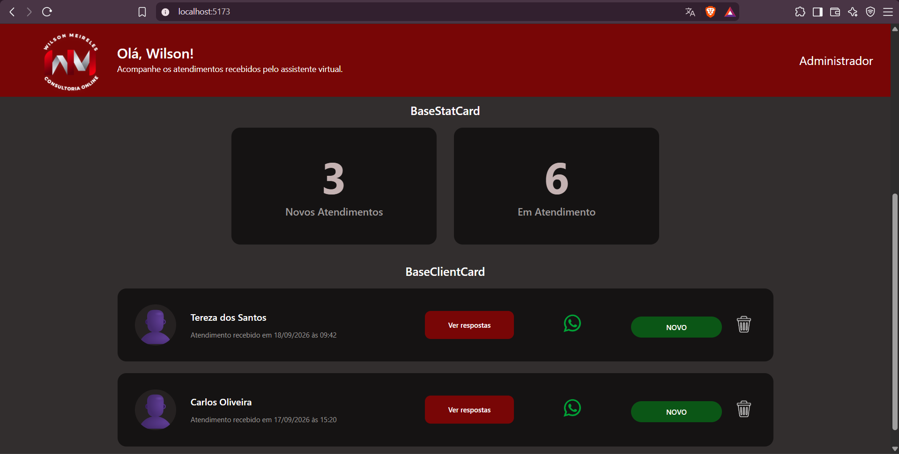

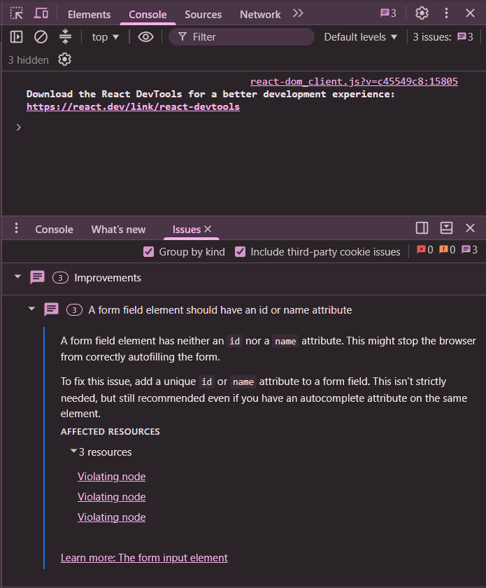

---

### QA-023-03 — Funcionamento do BaseButton

**Critério:** CA-01  
**Tipo:** Funcional / Interface

**Pré-condições:**
- Página de testes aberta.
- Componente BaseButton renderizado.

**Passos:**
1. Clicar no botão "Acessar Painel".
2. Verificar a mensagem apresentada.
3. Fechar o alerta.
4. Clicar no botão "Ver respostas".
5. Verificar a mensagem apresentada.
6. Fechar o alerta.
7. Clicar no botão desabilitado.
8. Verificar se alguma ação é executada.

**Resultado esperado:**
- O primeiro botão deve apresentar o alerta
  "Botão funcionando!".
- O segundo botão deve apresentar o alerta
  "Ver respostas funcionando!".
- O botão desabilitado não deve executar ações.

**Resultado obtido:**

- O botão "Acessar Painel" exibiu corretamente
  o alerta "Botão funcionando!".
- O botão "Ver respostas" exibiu corretamente
  o alerta "Ver respostas funcionando!".
- O botão desabilitado não executou nenhuma ação
  quando clicado.

Todos os comportamentos observados corresponderam
aos resultados esperados.

**Status:** Aprovado

**Evidências:**

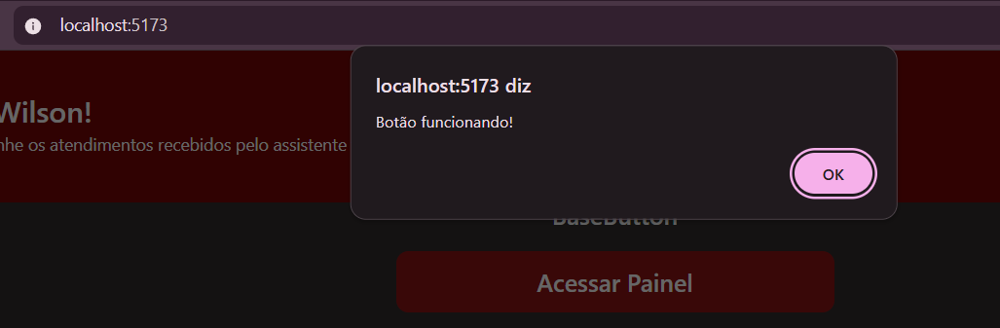

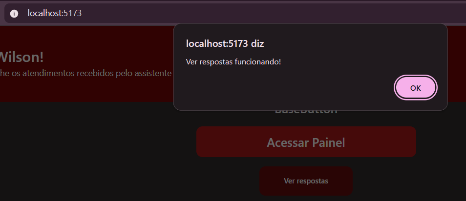

---

### QA-023-04 — Funcionamento do BaseInput

**Critério:** CA-01  
**Tipo:** Funcional / Interface

**Pré-condições:**
- Página de testes aberta.
- Componente BaseInput renderizado.

**Passos:**
1. Localizar o campo de e-mail.
2. Digitar um texto no campo.
3. Verificar se o texto aparece corretamente.
4. Localizar o campo de senha.
5. Digitar uma senha.
6. Verificar se os caracteres são ocultados.
7. Tentar digitar no campo desabilitado.

**Resultado esperado:**
- O campo de e-mail deve aceitar a digitação.
- O campo de senha deve ocultar os caracteres.
- O campo desabilitado não deve permitir edição.


**Resultado obtido:**

- O campo de e-mail permitiu inserir, apagar e
  modificar o texto normalmente.
- O campo de senha permitiu a digitação e
  ocultou os caracteres inseridos.
- O campo desabilitado não permitiu edição.

Os três comportamentos corresponderam aos
resultados esperados.

**Status:** Aprovado

**Evidências:**

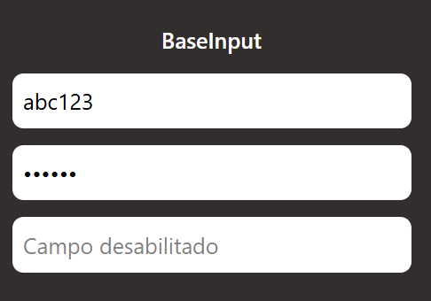

**Observação:**
Nenhuma observação

---

### QA-023-05 — Renderização do BaseStatCard

**Critério:** CA-01  
**Tipo:** Interface

**Pré-condições:**
- Página de testes aberta.

**Passos:**
1. Localizar os componentes BaseStatCard.
2. Verificar o título "Novos Atendimentos".
3. Verificar se o valor apresentado é 3.
4. Verificar o título "Em Atendimento".
5. Verificar se o valor apresentado é 6.
6. Observar o alinhamento dos elementos.

**Resultado esperado:**
Os dois cartões devem apresentar corretamente
os títulos e valores informados na página de testes.

**Resultado obtido:**

- O primeiro cartão apresentou corretamente o título
  "Novos Atendimentos" e o valor 3.
- O segundo cartão apresentou corretamente o título
  "Em Atendimento" e o valor 6.
- Ambos os cartões foram exibidos corretamente,
  com textos legíveis e sem problemas visuais
  identificados.

**Status:** Aprovado

**Evidências:**


---

### QA-023-06 — Funcionamento do BaseClientCard

**Critério:** CA-01  
**Tipo:** Funcional / Interface

**Pré-condições:**
- Página de testes aberta.
- Componente BaseClientCard renderizado.

**Passos:**
1. Localizar os cartões dos clientes.
2. Verificar a exibição dos nomes.
3. Verificar a exibição das datas e dos status.
4. Clicar no botão de visualizar respostas.
5. Verificar o alerta apresentado.
6. Clicar no botão do WhatsApp.
7. Verificar o alerta apresentado.
8. Clicar no botão de exclusão.
9. Verificar o alerta apresentado.

**Resultado esperado:**
Os cartões devem apresentar corretamente os
dados fornecidos pela página de testes.

Os botões devem executar as funções de teste
configuradas, apresentando os respectivos alertas.

**Resultado obtido:**

- Os cartões apresentaram corretamente os nomes,
  datas e status dos clientes.
- O botão "Ver respostas" apresentou o alerta
  "Ver respostas".
- O botão do WhatsApp apresentou o alerta
  "WhatsApp".
- O botão de exclusão apresentou o alerta
  "Excluir".
- Os componentes foram exibidos corretamente,
  sem sobreposições ou problemas visuais identificados.

Todos os comportamentos observados corresponderam
aos resultados esperados.

**Status:** Aprovado

**Evidências:**

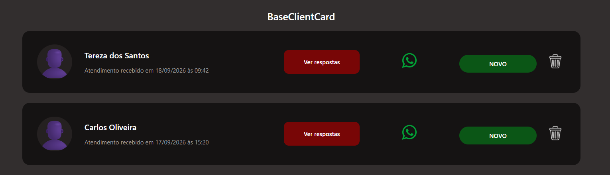

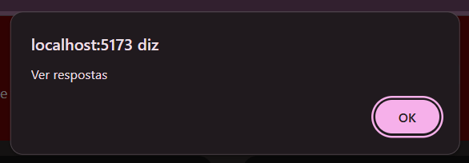

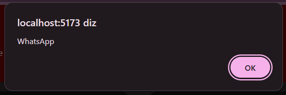

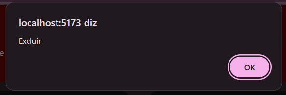

**Observação:**
A página utiliza alertas para simular as ações.
Este teste não valida a integração real com
WhatsApp nem a exclusão de clientes.

---

### QA-023-07 — Renderização do BaseHeader

**Critério:** CA-01  
**Tipo:** Interface

**Pré-condições:**
- Página de testes aberta.

**Passos:**
1. Acessar a página de testes.
2. Localizar o cabeçalho.
3. Verificar se seus elementos são apresentados.
4. Observar possíveis problemas de alinhamento
   ou sobreposição.

**Resultado esperado:**
O cabeçalho deve ser apresentado corretamente,
sem erros visuais ou de renderização.

**Resultado obtido:**

O BaseHeader foi renderizado corretamente na página
de testes.

- A logo foi exibida corretamente.
- A identificação "Olá, Wilson!" foi apresentada.
- O perfil "Administrador" foi apresentado.
- Não foram identificados textos cortados,
  sobreposições ou outros problemas visuais.

**Status:** Aprovado

**Evidências:**


---

### QA-023-08 — Documentação e valores padrão das props

**Critério:** CA-02  
**Tipo:** Teste estático / Revisão de código

**Pré-condições:**
- Código-fonte dos componentes disponível.
- Versão da implementação identificada.

**Passos:**
1. Abrir o arquivo BaseButton.jsx.
2. Identificar as props utilizadas.
3. Verificar sua documentação e valores padrão.
4. Repetir o procedimento para BaseInput.jsx.
5. Repetir para BaseStatCard.jsx.
6. Repetir para BaseClientCard.jsx.
7. Repetir para BaseHeader.jsx.
8. Registrar eventuais propriedades sem
   documentação ou valores padrão definidos.

**Resultado esperado:**
As props devem estar documentadas e possuir
valores padrão conforme os critérios de
aceitação da issue.

**Análise dos componentes:**

#### BaseButton

- Props documentadas por meio de JSDoc.
- `texto`, `variante` e `disabled` possuem valores padrão.
- Foi identificada divergência entre a documentação e a
  implementação do valor padrão de `texto`: a documentação
  informa `"Clique aqui"`, enquanto o código define
  `"Clicque aqui"`.
- A documentação informa que `onClick` possui uma função
  vazia como valor padrão, porém nenhum valor padrão foi
  definido na implementação.

#### BaseInput

- Todas as props estão documentadas por meio de JSDoc.
- `tipo`, `placeholder`, `value`, `onChange` e `disabled`
  possuem valores padrão definidos.
- Os valores padrão descritos na documentação correspondem
  aos valores definidos na implementação.
- Não foram identificadas inconsistências entre a
  documentação e a implementação das props.
  
#### BaseStatCard

- As props `valor` e `titulo` estão documentadas por meio de JSDoc.
- Ambas as props possuem valores padrão definidos.
- O valor padrão de `valor` corresponde à documentação (`"00"`).
- Foi identificada uma divergência no valor padrão de `titulo`:
  a documentação informa `"Sem título"` (com acento), enquanto a implementação
  define `"Sem titulo"`.
  
#### BaseClientCard

- Todas as props estão documentadas por meio de JSDoc.
- As props `nome`, `data` e `status` possuem valores padrão
  definidos e correspondentes à documentação.
- A documentação informa que `onVerRespostas`, `onWhatsApp`
  e `onExcluir` possuem funções vazias como valores padrão.
- Entretanto, nenhum valor padrão foi definido para essas
  três props na implementação.

#### BaseHeader

- Todas as props estão documentadas por meio de JSDoc.
- As props `nome`, `descricao` e `perfil` possuem valores
  padrão definidos.
- Os valores padrão descritos na documentação correspondem
  aos valores definidos na implementação.
- Não foram identificadas inconsistências entre a
  documentação e a implementação das props.

**Resultado obtido:**

As props dos cinco componentes foram analisadas quanto
à documentação e à definição de valores padrão.

`BaseInput` e `BaseHeader` apresentaram documentação e
valores padrão consistentes com a implementação.

Foram identificadas as seguintes inconsistências:

- `BaseButton`: a documentação informa `"Clique aqui"` como
  valor padrão de `texto`, enquanto a implementação define
  `"Clicque aqui"`. A prop `onClick` está documentada com
  uma função vazia como valor padrão, porém, na implementação,
  não há valor padrão atribuído, resultando em `undefined`
  quando a prop não é fornecida.

- `BaseStatCard`: a documentação informa `"Sem título"` como
  valor padrão de `titulo`, enquanto a implementação define
  `"Sem titulo"`.

- `BaseClientCard`: as props `onVerRespostas`, `onWhatsApp`
  e `onExcluir` estão documentadas com funções vazias como
  valores padrão. Entretanto, não há valores padrão atribuídos
  a essas props na implementação, resultando em `undefined`
  quando não são fornecidas.

**Status:** Reprovado

**Evidências:**

**BaseButton — divergência nos valores padrão**

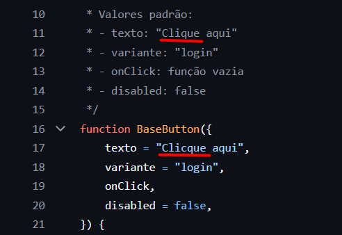

**BaseStatCard — divergência no valor padrão de titulo**

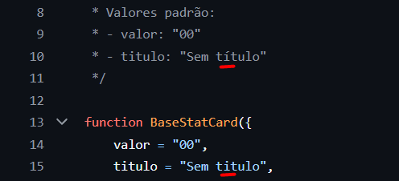

**BaseClientCard — callbacks sem valores padrão**

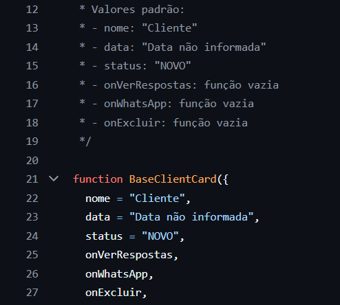

---

## 6. Resumo da Execução

| Caso | Descrição | Status |
|---|---|---|
| QA-023-01 | Inicialização do frontend | Aprovado |
| QA-023-02 | Renderização dos componentes | Aprovado com observação |
| QA-023-03 | Funcionamento do BaseButton | Aprovado |
| QA-023-04 | Funcionamento do BaseInput | Aprovado |
| QA-023-05 | Renderização do BaseStatCard | Aprovado |
| QA-023-06 | Funcionamento do BaseClientCard | Aprovado |
| QA-023-07 | Renderização do BaseHeader | Aprovado |
| QA-023-08 | Documentação e valores padrão das props | Reprovado |

## 7. Registro de Defeitos

Durante a execução dos testes foram identificadas
inconsistências relacionadas à documentação e aos valores
padrão das props, registradas no caso QA-023-08.

As inconsistências serão comunicadas na issue #23 para
avaliação e correção pelo responsável pela implementação.

Não foram identificadas falhas que impedissem a
inicialização ou a renderização dos componentes.

**Defeitos confirmados:**

- Inconsistência entre o valor padrão documentado e implementado
  da prop `texto` no `BaseButton`.
- A prop `onClick` do `BaseButton` é documentada com uma função
  vazia como valor padrão, mas não possui esse valor definido
  na implementação.
- Inconsistência entre o valor padrão documentado e implementado
  da prop `titulo` no `BaseStatCard`.
- As props `onVerRespostas`, `onWhatsApp` e `onExcluir` do
  `BaseClientCard` são documentadas com funções vazias como
  valores padrão, mas não possuem esses valores definidos
  na implementação.

**Total de defeitos identificados:** 4

## 8. Considerações Finais

A implementação da issue #23 foi submetida a oito casos
de teste, abrangendo inicialização do frontend,
renderização e funcionamento dos componentes e revisão
da documentação das props.

Os testes funcionais e de renderização foram concluídos
com sucesso. O frontend iniciou corretamente e os
componentes apresentaram o comportamento esperado durante
os testes realizados.

Entretanto, o critério de aceitação referente à
documentação e aos valores padrão das props não foi
atendido integralmente. Foram identificadas inconsistências
nos componentes BaseButton, BaseStatCard e BaseClientCard,
conforme detalhado no caso QA-023-08.

Dessa forma, a validação da issue permanece pendente de
correção das inconsistências identificadas no QA-023-08.
**Status:** Não executado

**Evidências:** Pendentes.
