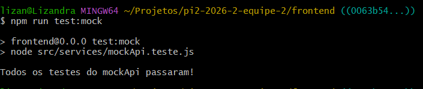
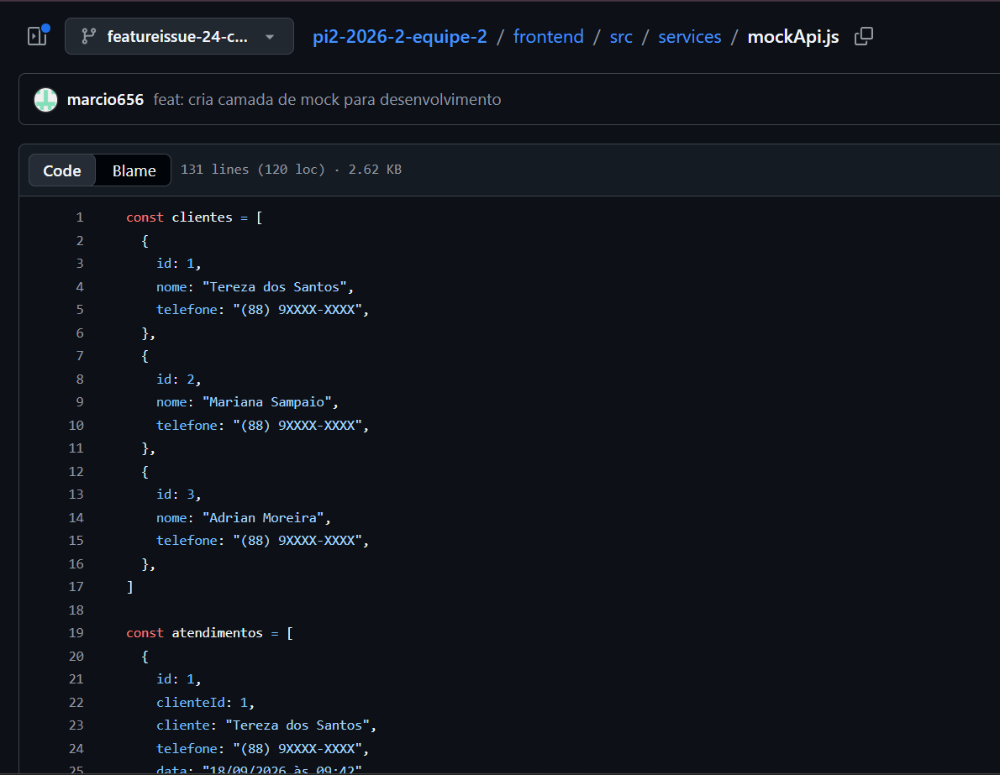
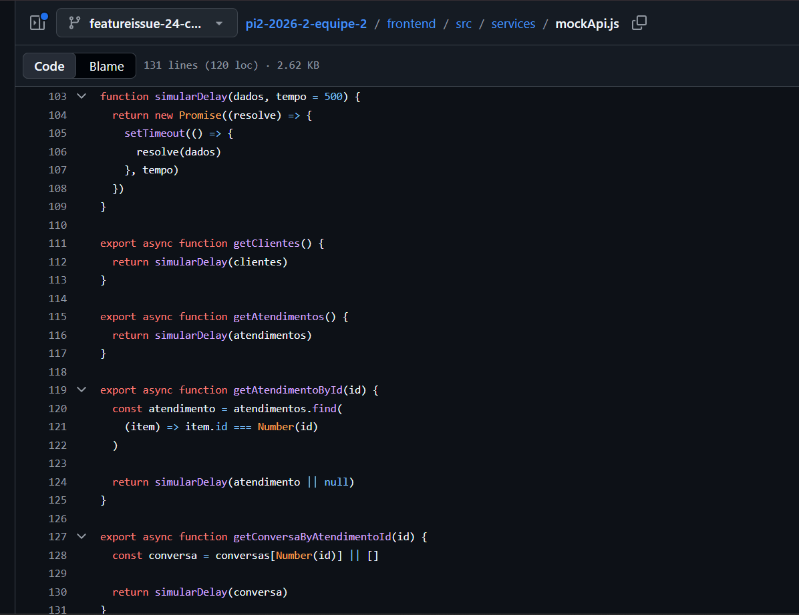
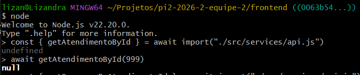
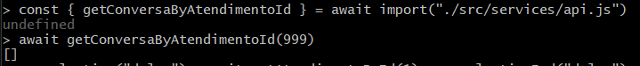
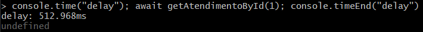
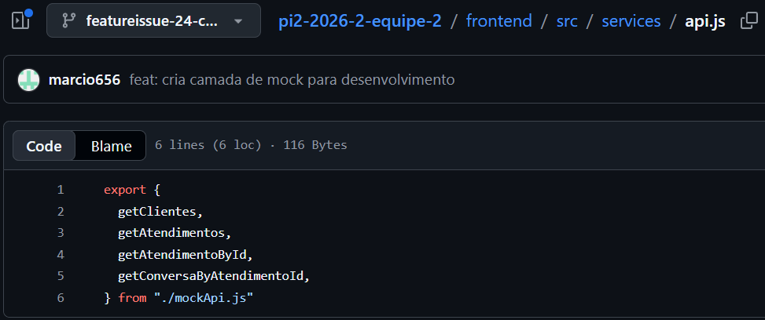

# Relatório de Execução de Testes — Issue #24

## 1. Identificação

**Issue:** #24 — Criar camada de mock de dados para desenvolvimento sem backend  
**Issue de QA:** #45  
**Branch testada:** `featureissue-24-criar-camada-mock`  
**Responsável pela validação:** QA  
**Ambiente:** Windows / Node.js v22.20.0

---

## 2. Objetivo

Validar a camada de mock de dados implementada na issue #24,
verificando o retorno dos dados simulados, o comportamento das
funções assíncronas, a simulação de delay e a estrutura de
abstração utilizada para futura integração com a API real.

---

## 3. Critérios de Aceitação

- As funções retornam os dados mockados corretamente.
- A estrutura permite trocar o mock pela API real sem alterar as telas.

---

## 4. Preparação do Ambiente

A branch da implementação foi acessada para execução dos testes:

```bash
git fetch origin
git switch --detach origin/featureissue-24-criar-camada-mock
cd frontend
npm install
```

O ambiente foi preparado sem erros impeditivos para a execução
dos testes.

---

## 5. Casos de Teste

### QA-024-01 — Execução dos testes automatizados do mock

**Objetivo:**

Verificar se os testes automatizados implementados para a camada
de mock são executados com sucesso.

**Procedimento:**

1. Acessar o diretório `frontend`.
2. Executar o comando:

```bash
npm run test:mock
```

3. Verificar o resultado apresentado no terminal.

**Resultado esperado:**

Os testes automatizados devem ser executados sem erros e as
asserções definidas em `mockApi.teste.js` devem ser satisfeitas.

**Resultado obtido:**

O comando foi executado com sucesso. Foram validadas chamadas para:

- `getClientes()`;
- `getAtendimentos()`;
- `getAtendimentoById(1)`;
- `getConversaByAtendimentoId(1)`.

Ao final da execução, foi apresentada a mensagem:

```text
Todos os testes do mockApi passaram!
```

As quatro asserções presentes no teste automatizado foram executadas
sem apresentar erros.

**Status:** Aprovado

**Evidência:**



---

### QA-024-02 — Estrutura e dados mockados

**Objetivo:**

Verificar se a camada de mock possui dados simulados e funções
adequadas para permitir o desenvolvimento do frontend sem
dependência do backend.

**Procedimento:**

1. Inspecionar o arquivo `src/services/mockApi.js`.
2. Verificar a existência de dados mockados de clientes.
3. Verificar a existência de dados mockados de atendimentos.
4. Verificar a existência de dados mockados de conversas.
5. Verificar as funções disponibilizadas para acesso aos dados.

**Resultado esperado:**

A camada de mock deve possuir dados simulados de clientes,
atendimentos e conversas, além de funções que permitam acessar
esses dados.

**Resultado obtido:**

O arquivo `mockApi.js` contém:

- 3 clientes mockados;
- 3 atendimentos mockados;
- conversas associadas aos atendimentos de IDs 1, 2 e 3;
- função `getClientes()`;
- função `getAtendimentos()`;
- função `getAtendimentoById(id)`;
- função `getConversaByAtendimentoId(id)`;
- função interna `simularDelay()`.

A estrutura necessária para disponibilização dos dados mockados
foi identificada na implementação.

**Status:** Aprovado

**Evidências:**





---

### QA-024-03 — Retorno de atendimento inexistente

**Objetivo:**

Verificar o comportamento da função `getAtendimentoById(id)` quando
é informado um ID que não corresponde a nenhum atendimento mockado.

**Procedimento:**

1. Iniciar o Node.js no diretório `frontend`:

```bash
node
```

2. Importar a função por meio da camada `api.js`:

```js
const { getAtendimentoById } = await import("./src/services/api.js")
```

3. Executar a função utilizando um ID inexistente:

```js
await getAtendimentoById(999)
```

4. Verificar o valor retornado.

**Resultado esperado:**

A função deve retornar `null` quando não for encontrado um
atendimento correspondente ao ID informado.

**Resultado obtido:**

A chamada `getAtendimentoById(999)` retornou:

```text
null
```

O comportamento observado corresponde ao tratamento definido
para atendimentos inexistentes.

**Status:** Aprovado

**Evidência:**



---

### QA-024-04 — Retorno de conversa inexistente

**Objetivo:**

Verificar o comportamento da função `getConversaByAtendimentoId(id)`
quando é informado um ID que não possui conversa mockada associada.

**Procedimento:**

1. Iniciar o Node.js no diretório `frontend`:

```bash
node
```

2. Importar a função por meio da camada `api.js`:

```js
const { getConversaByAtendimentoId } = await import("./src/services/api.js")
```

3. Executar a função utilizando um ID inexistente:

```js
await getConversaByAtendimentoId(999)
```

4. Verificar o valor retornado.

**Resultado esperado:**

A função deve retornar um array vazio `[]` quando não existir
uma conversa associada ao ID informado.

**Resultado obtido:**

A chamada `getConversaByAtendimentoId(999)` retornou:

```text
[]
```

O comportamento observado corresponde ao tratamento definido
para conversas inexistentes.

**Status:** Aprovado

**Evidência:**



---

### QA-024-05 — Simulação de delay

**Objetivo:**

Verificar se as funções da camada de mock simulam a latência
de uma chamada à API antes de retornar os dados.

**Procedimento:**

1. Iniciar o Node.js no diretório `frontend`.

```bash
node
```

2. Importar a função `getAtendimentoById` por meio da camada `api.js`.

```js
const { getAtendimentoById } = await import("./src/services/api.js")
```

3. Medir o tempo de execução da chamada:

```js
console.time("delay"); await getAtendimentoById(1); console.timeEnd("delay")
```

4. Verificar o tempo apresentado no terminal.

**Resultado esperado:**

A chamada deve apresentar tempo de espera próximo ou superior
a 500 ms, correspondente ao delay padrão definido pela função
`simularDelay()`.

**Resultado obtido:**

A execução apresentou o seguinte tempo:

```text
delay: 512.968ms
```

O tempo observado é compatível com o delay padrão de 500 ms
definido na implementação.

**Status:** Aprovado

**Evidência:**



---

### QA-024-06 — Abstração entre mock e API real

**Objetivo:**

Verificar se a estrutura da camada de serviços permite substituir
a implementação mockada por uma API real sem exigir alterações
nas telas que utilizam os serviços.

**Procedimento:**

1. Inspecionar o arquivo `src/services/api.js`.
2. Verificar de onde as funções utilizadas pelo frontend são exportadas.
3. Comparar a interface exposta por `api.js` com as funções implementadas
   em `mockApi.js`.
4. Verificar a existência de documentação explicando como substituir
   a implementação mockada pela API real.

**Resultado esperado:**

O acesso aos dados deve estar centralizado em uma camada de serviço,
permitindo que a implementação mockada seja posteriormente substituída
por chamadas à API real sem alterar as telas consumidoras.

Também deve existir documentação orientando como realizar essa
substituição.

**Resultado obtido:**

O arquivo `api.js` centraliza a interface utilizada para acesso aos
dados e atualmente exporta as seguintes funções de `mockApi.js`:

```js
export {
  getClientes,
  getAtendimentos,
  getAtendimentoById,
  getConversaByAtendimentoId,
} from "./mockApi.js"
```

Essa estrutura cria uma camada de abstração entre os consumidores
dos serviços e a implementação mockada. Mantendo a mesma interface
em uma futura implementação da API real, a fonte dos dados pode ser
alterada na camada de serviços sem necessidade de alteração nas telas
que utilizam `api.js`.

Entretanto, durante a revisão dos arquivos alterados na implementação
da issue #24, não foi encontrada documentação explicando o procedimento
para substituir o mock pela API real, apesar dessa atividade estar
prevista na issue.

**Status:** Aprovado com observação

**Observação:**

A estrutura necessária para futura substituição do mock foi
implementada. Recomenda-se adicionar a documentação prevista na
issue explicando como realizar essa substituição.

**Evidência:**



---

## 6. Resumo da Execução

| Caso | Descrição | Status |
|---|---|---|
| QA-024-01 | Execução dos testes automatizados do mock | Aprovado |
| QA-024-02 | Estrutura e dados mockados | Aprovado |
| QA-024-03 | Retorno de atendimento inexistente | Aprovado |
| QA-024-04 | Retorno de conversa inexistente | Aprovado |
| QA-024-05 | Simulação de delay | Aprovado |
| QA-024-06 | Abstração entre mock e API real | Aprovado com observação |

## 7. Registro de Defeitos e Observações

Durante a execução dos testes não foram identificados defeitos
funcionais na camada de mock de dados.

As funções testadas apresentaram os retornos esperados, incluindo
o tratamento de IDs inexistentes e a simulação de delay. A camada
`api.js` também fornece uma abstração entre os consumidores dos
serviços e a implementação presente em `mockApi.js`.

### Observação identificada

Durante a revisão da implementação foi identificada uma pendência
relacionada à atividade de documentação prevista na issue #24:

- Não foi encontrada, nos arquivos alterados pela implementação,
  documentação explicando como substituir a camada de mock pela
  API real no futuro.

A ausência dessa documentação não impediu o funcionamento da
implementação nem invalidou a estrutura de abstração identificada
no QA-024-06.

**Defeitos funcionais identificados:** 0

**Observações/Pendências:** 1

## 8. Considerações Finais

A implementação da issue #24 foi submetida a seis casos de teste,
abrangendo a execução dos testes automatizados, a estrutura dos
dados mockados, o tratamento de IDs inexistentes, a simulação de
delay e a abstração entre a camada de mock e uma futura API real.

Os testes executados foram concluídos com sucesso. As funções da
camada de mock apresentaram os retornos esperados e a simulação
de latência funcionou conforme definido na implementação.

A análise do arquivo `api.js` também confirmou a existência de uma
camada de abstração entre os consumidores dos serviços e a
implementação presente em `mockApi.js`, permitindo que a fonte dos
dados seja posteriormente substituída mantendo a mesma interface
utilizada pelo frontend.

Não foram identificados defeitos funcionais durante a validação.

Entretanto, foi registrada uma observação referente à documentação:
não foi encontrada, nos arquivos alterados pela implementação,
documentação explicando como realizar a substituição do mock pela
API real, apesar dessa atividade estar prevista na issue #24.

Dessa forma, os critérios de aceitação avaliados foram atendidos,
permanecendo como pendência apenas a documentação mencionada no
QA-024-06.

**Resultado final da validação QA: Aprovado com observação**
