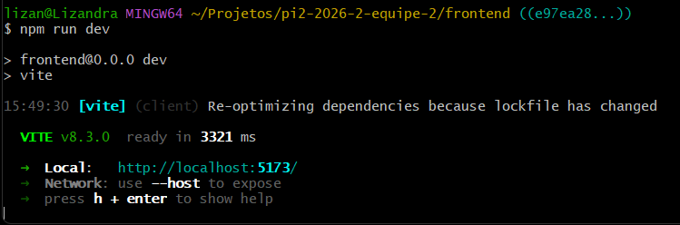
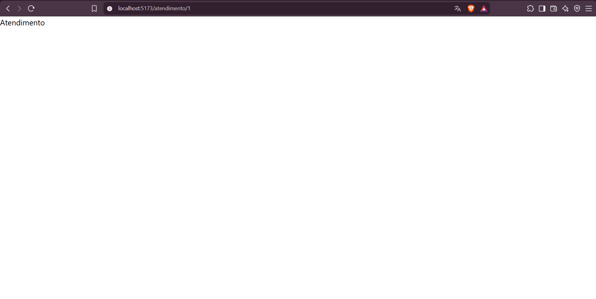
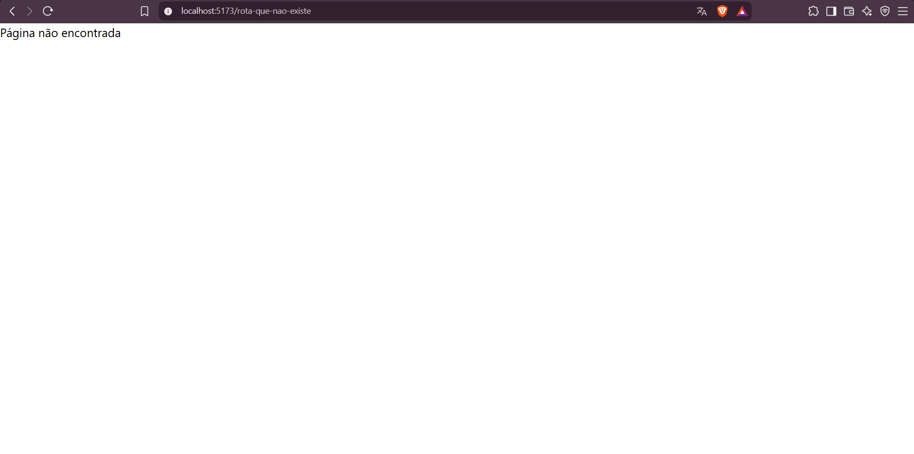
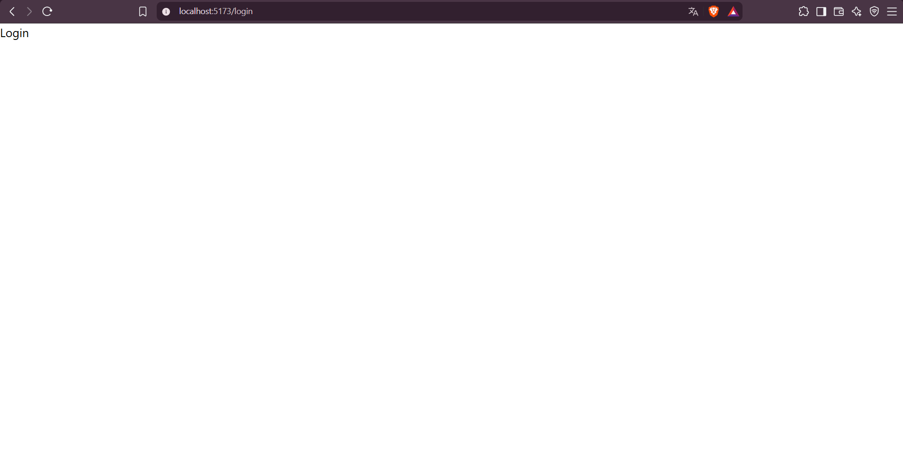
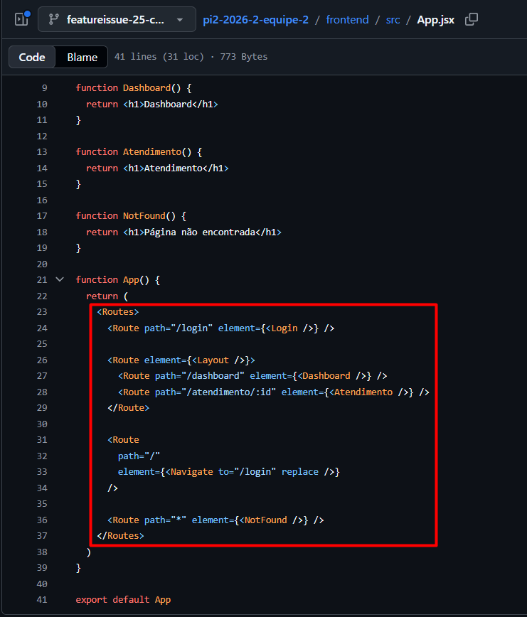
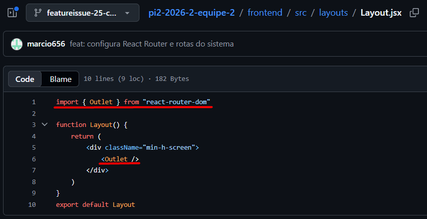

# Relatório de Execução de Testes — Issue #25

## 1. Identificação

**Issue:** #25 — Configurar React Router e rotas do sistema  
**Issue de QA:** #47  
**Branch testada:** `featureissue-25-configurar-react-router`  
**Responsável pela validação:** QA  
**Ambiente:** Windows / React / Vite / React Router DOM 7.18.4

---

## 2. Objetivo

Validar a configuração do React Router e das rotas do sistema
implementadas na issue #25, verificando a inicialização do frontend,
o acesso às rotas previstas, o funcionamento da rota dinâmica,
a utilização do layout das páginas autenticadas, o redirecionamento
da rota padrão e o tratamento de rotas inexistentes.

---

## 3. Critérios de Aceitação

- Navegação entre rotas funciona.
- Rota inexistente mostra página 404.
- `npm run dev` sobe sem erros.

---

## 4. Preparação do Ambiente

A branch da implementação foi acessada para execução dos testes:

```bash
git fetch origin
git switch --detach origin/featureissue-25-configurar-react-router
cd frontend
npm install
```

Após a preparação do ambiente, o frontend foi iniciado com:

```bash
npm run dev
```

O ambiente foi preparado sem erros impeditivos para a execução
dos testes.

---

## 5. Casos de Teste

### QA-025-01 — Inicialização do frontend

**Objetivo:**

Verificar se o frontend inicia corretamente na branch da
implementação da issue #25.

**Procedimento:**

1. Acessar o diretório `frontend`.
2. Executar o comando:

```bash
npm run dev
```

3. Verificar se o servidor de desenvolvimento do Vite é iniciado
   sem apresentar erros impeditivos.

**Resultado esperado:**

O servidor de desenvolvimento deve iniciar corretamente e
disponibilizar a aplicação em um endereço local sem apresentar
erros de inicialização.

**Resultado obtido:**

O comando `npm run dev` foi executado com sucesso e o servidor
de desenvolvimento do Vite foi iniciado, disponibilizando a
aplicação localmente.

Não foram identificados erros impeditivos durante a inicialização.

**Status:** Aprovado

**Evidência:**



---

### QA-025-02 — Acesso à rota `/login`

**Objetivo:**

Verificar se a rota `/login` está configurada e pode ser acessada
corretamente.

**Procedimento:**

1. Manter o frontend em execução.
2. Acessar no navegador a rota `/login`.
3. Verificar o conteúdo renderizado.

**Resultado esperado:**

A rota `/login` deve ser reconhecida pelo React Router e renderizar
a página correspondente sem apresentar erro ou página 404.

**Resultado obtido:**

A rota `/login` foi acessada com sucesso e apresentou o conteúdo
"Login", sem erros visíveis durante o teste.

**Status:** Aprovado

**Evidência:**


---

### QA-025-03 — Acesso à rota `/dashboard`

**Objetivo:**

Verificar se a rota `/dashboard` está configurada e renderizada
corretamente.

**Procedimento:**

1. Acessar no navegador a rota `/dashboard`.
2. Verificar o conteúdo apresentado.

**Resultado esperado:**

A rota `/dashboard` deve ser reconhecida pelo React Router e
renderizar a página correspondente por meio do layout configurado.

**Resultado obtido:**

A rota `/dashboard` foi acessada com sucesso e apresentou o
conteúdo "Dashboard", sem erros visíveis durante o teste.

**Status:** Aprovado

**Evidência:**


---

### QA-025-04 — Acesso à rota dinâmica `/atendimento/:id`

**Objetivo:**

Verificar se a rota dinâmica de atendimento aceita um identificador
na URL e renderiza a página correspondente.

**Procedimento:**

1. Acessar no navegador:

```text
/atendimento/1
```

2. Verificar se a rota é reconhecida.
3. Verificar o conteúdo renderizado.

**Resultado esperado:**

A rota `/atendimento/:id` deve reconhecer o valor informado no
segmento `:id` e renderizar a página de atendimento.

**Resultado obtido:**

A rota `/atendimento/1` foi reconhecida e apresentou o conteúdo
"Atendimento", sem redirecionamento para a página 404.

**Status:** Aprovado

**Evidência:**



---

### QA-025-05 — Tratamento de rota inexistente

**Objetivo:**

Verificar o comportamento da aplicação quando o usuário acessa
uma rota que não está cadastrada.

**Procedimento:**

1. Acessar uma rota inexistente:

```text
/rota-que-nao-existe
```

2. Verificar o conteúdo apresentado pela aplicação.

**Resultado esperado:**

Uma rota não cadastrada deve ser capturada pela rota curinga e
apresentar a página de conteúdo não encontrado.

**Resultado obtido:**

Ao acessar `/rota-que-nao-existe`, a aplicação apresentou a
mensagem "Página não encontrada".

A rota inexistente foi tratada conforme esperado.

**Status:** Aprovado

**Evidência:**



---

### QA-025-06 — Redirecionamento da rota padrão

**Objetivo:**

Verificar o comportamento da aplicação quando a rota raiz `/`
é acessada.

**Procedimento:**

1. Acessar a rota `/`.
2. Observar a URL após o carregamento.
3. Verificar o conteúdo apresentado.

**Resultado esperado:**

A rota `/` deve redirecionar automaticamente o usuário para
`/login`.

**Resultado obtido:**

Ao acessar a rota `/`, a aplicação realizou o redirecionamento
automaticamente para `/login` e apresentou o conteúdo "Login".

**Status:** Aprovado

**Evidência:**



---

### QA-025-07 — Configuração do React Router e Layout

**Objetivo:**

Verificar a configuração estrutural do React Router e do layout
utilizado pelas páginas autenticadas.

**Procedimento:**

1. Inspecionar o arquivo `src/main.jsx`.
2. Verificar a utilização do `BrowserRouter`.
3. Inspecionar o arquivo `src/App.jsx`.
4. Verificar a configuração das rotas.
5. Inspecionar o arquivo `src/layouts/Layout.jsx`.
6. Verificar a utilização do componente `Outlet`.
7. Verificar a instalação do `react-router-dom` no `package.json`.

**Resultado esperado:**

A aplicação deve utilizar `BrowserRouter` como contexto de
roteamento, possuir as rotas previstas na issue e utilizar um
`Layout` com `Outlet` para as páginas configuradas como rotas filhas.

A dependência `react-router-dom` deve estar instalada no projeto.

**Resultado obtido:**

Foi identificado o uso de `BrowserRouter` no arquivo `main.jsx`.

O arquivo `App.jsx` contém as seguintes configurações:

- `/login`;
- `/dashboard`;
- `/atendimento/:id`;
- redirecionamento de `/` para `/login`;
- rota curinga `*` para conteúdo não encontrado.

As rotas `/dashboard` e `/atendimento/:id` estão configuradas como
rotas filhas do componente `Layout`.

O arquivo `Layout.jsx` utiliza o componente `Outlet` para renderização
das rotas filhas.

Também foi confirmada a dependência:

```text
react-router-dom: ^7.18.4
```

**Status:** Aprovado

**Evidências:**





---

### QA-025-08 — Navegação entre rotas

**Objetivo:**

Verificar a possibilidade de navegação entre as rotas configuradas
na aplicação.

**Procedimento:**

1. Acessar individualmente as rotas configuradas.
2. Verificar se cada rota é reconhecida e renderizada corretamente.
3. Inspecionar a implementação em busca de mecanismos de navegação
   interna, como `Link`, `NavLink` ou `useNavigate`.

**Resultado esperado:**

As rotas configuradas devem permitir acesso aos conteúdos
correspondentes e a aplicação deve possibilitar a navegação
entre as páginas previstas.

**Resultado obtido:**

As rotas `/login`, `/dashboard` e `/atendimento/1` puderam ser
acessadas diretamente e renderizaram seus respectivos conteúdos
corretamente.

Entretanto, na implementação analisada não foi identificado um
mecanismo de navegação interna entre essas páginas, como `Link`,
`NavLink` ou `useNavigate`.

Dessa forma, foi possível validar o funcionamento das rotas por
acesso direto às URLs, mas não foi possível validar uma transição
entre as páginas acionada pela interface da aplicação.

**Status:** Aprovado com observação

**Observação:**

As rotas estão configuradas e acessíveis. Recomenda-se validar
novamente a navegação entre páginas quando os elementos de interface
responsáveis por essa navegação estiverem implementados.

---

## 6. Resumo da Execução

| Caso | Descrição | Status |
|---|---|---|
| QA-025-01 | Inicialização do frontend | Aprovado |
| QA-025-02 | Acesso à rota `/login` | Aprovado |
| QA-025-03 | Acesso à rota `/dashboard` | Aprovado |
| QA-025-04 | Acesso à rota `/atendimento/:id` | Aprovado |
| QA-025-05 | Tratamento de rota inexistente | Aprovado |
| QA-025-06 | Redirecionamento da rota padrão | Aprovado |
| QA-025-07 | Configuração do React Router e Layout | Aprovado |
| QA-025-08 | Navegação entre rotas | Aprovado com observação |

---

## 7. Registro de Defeitos e Observações

Durante a execução dos testes não foram identificados defeitos
funcionais que impedissem o funcionamento das rotas configuradas.

As rotas previstas na issue foram reconhecidas corretamente, o
redirecionamento da rota padrão funcionou conforme esperado e
uma rota inexistente apresentou o conteúdo de página não encontrada.

### Observação identificada

Durante a análise da navegação foi observado que não há, na
implementação analisada, mecanismos de navegação interna entre
as páginas, como `Link`, `NavLink` ou `useNavigate`.

Os testes de acesso às rotas foram realizados diretamente pelas
URLs e todas as rotas testadas funcionaram corretamente.

A observação não impede o funcionamento do roteamento configurado,
mas limita a validação da navegação entre páginas por meio da
interface atual.

**Defeitos funcionais identificados:** 0

**Observações:** 1

---

## 8. Considerações Finais

A implementação da issue #25 foi submetida a oito casos de teste,
abrangendo a inicialização do frontend, acesso às rotas configuradas,
rota dinâmica, tratamento de rota inexistente, redirecionamento da
rota padrão e revisão da configuração do React Router e do Layout.

O frontend iniciou corretamente com `npm run dev` e as rotas
`/login`, `/dashboard` e `/atendimento/:id` foram reconhecidas e
renderizadas conforme esperado.

A rota padrão `/` realizou corretamente o redirecionamento para
`/login`, enquanto uma rota inexistente apresentou o conteúdo
"Página não encontrada".

A revisão da implementação confirmou o uso de `BrowserRouter`,
a configuração das rotas no `App.jsx`, a utilização de `Layout`
com `Outlet` e a instalação da dependência `react-router-dom`.

Não foram identificados defeitos funcionais durante a validação.

Foi registrada uma observação referente à navegação entre páginas:
as rotas puderam ser validadas por acesso direto às URLs, porém
não foram identificados mecanismos de navegação interna pela
interface na implementação analisada.

**Resultado final da validação QA: Aprovado com observação**
