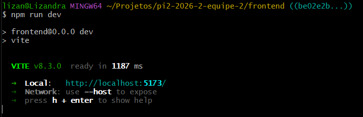
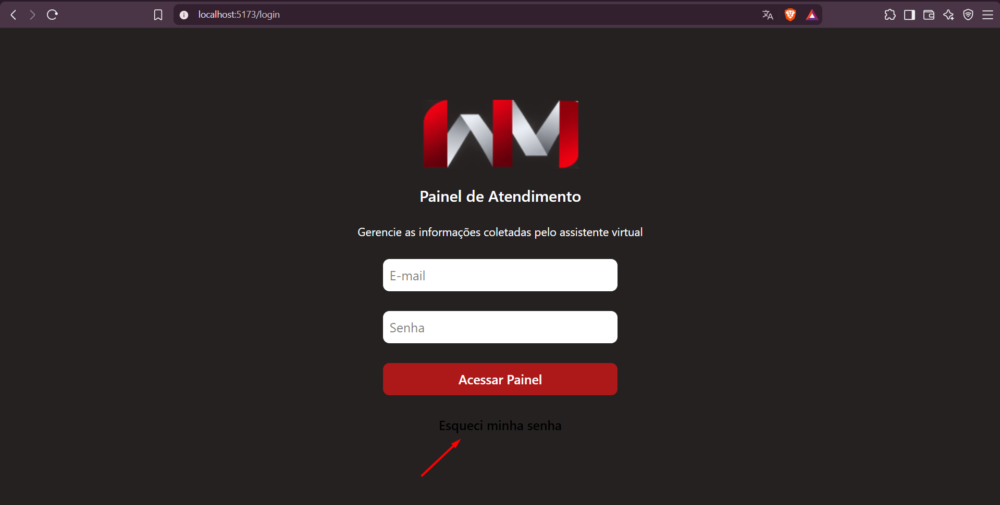
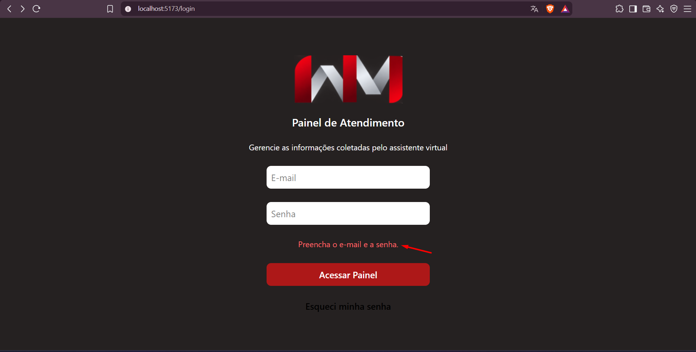
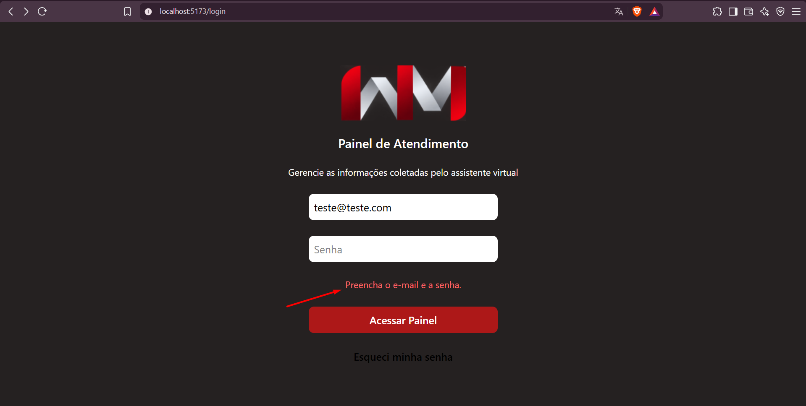
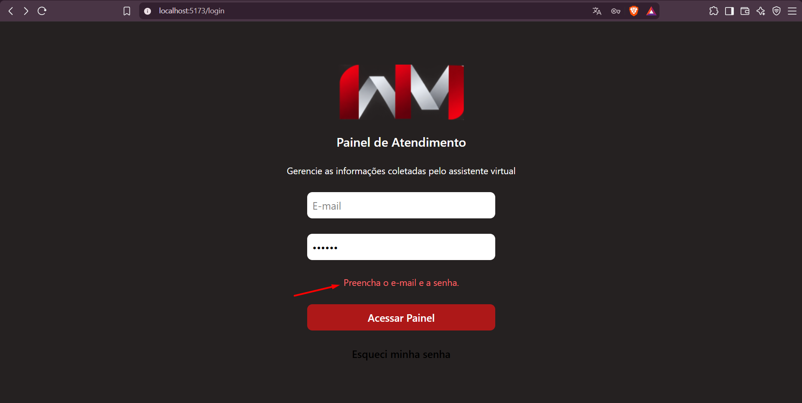
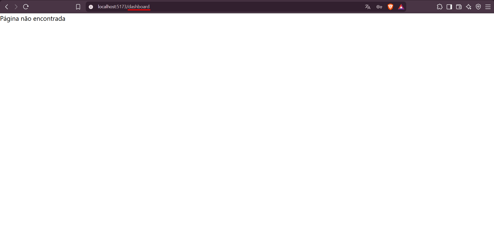
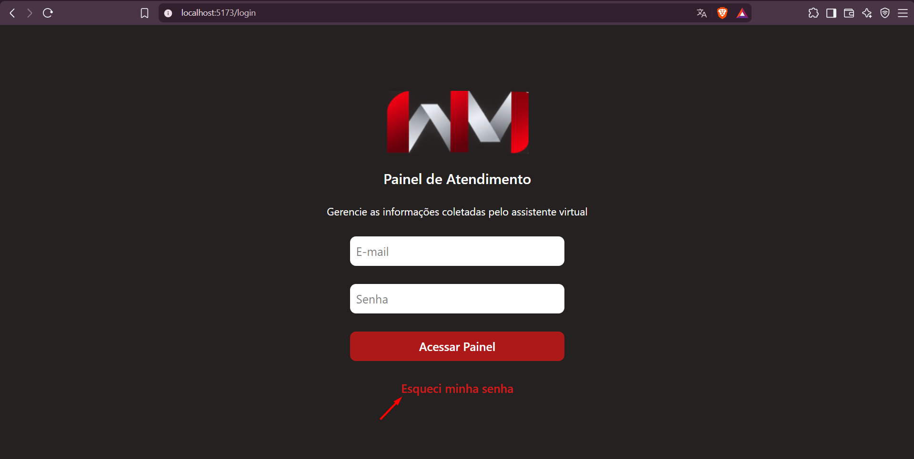

# Relatório de Testes — Issue #26

## 1. Identificação

- **Issue:** #26 — Implementar tela de Login
- **Issue de QA da validação inicial:** #58 — QA — Validar implementação da tela de Login (#26)
- **Issue de QA do reteste:** #70 — QA — Retestar correção da issue #26
- **Requisito relacionado:** RF018 — Autenticação do administrador
- **Requisito não funcional relacionado:** RNF014 — Controle de acesso
- **Branch testada:** `frontend/implementar+tela+login/26`
- **Commit da validação inicial:** `be02e2b`
- **Commit do reteste:** `9bc4b10` — `minor changes`
- **Responsável pelos testes:** QA
- **Resultado final:** ✅ Aprovado após reteste

---

## 2. Objetivo

Validar a implementação da tela de Login desenvolvida na issue #26, verificando os critérios de aceitação definidos, o funcionamento dos campos obrigatórios, o redirecionamento para o Dashboard e a conformidade visual com o protótipo disponibilizado pela equipe de Design.

O reteste teve como objetivo verificar a correção da observação visual identificada durante a validação inicial.

---

## 3. Critérios de Aceitação

Foram considerados os seguintes critérios definidos na issue #26:

- Layout fiel ao protótipo;
- Validação impede envio com campos vazios;
- Botão redireciona para `/dashboard`, mesmo sem autenticação real no momento.

Também foram verificados os elementos previstos na implementação:

- Logo do projeto;
- Campo de e-mail;
- Campo de senha;
- Botão "Acessar Painel";
- Link "Esqueci minha senha".

---

## 4. Ambiente e Preparação

- Frontend executado localmente com Vite;
- URL utilizada: `http://localhost:5173/login`;
- Branch da issue testada em detached HEAD;
- Dependências verificadas com `npm install`;
- Aplicação iniciada com `npm run dev`;
- Protótipo do Figma utilizado como referência visual.

Para o reteste, a branch foi atualizada e testada no commit `9bc4b10`.

---

## 5. Casos de Teste

### QA-026-01 — Inicialização do frontend

**Objetivo:**  
Verificar se o frontend inicia corretamente na branch da issue #26.

**Procedimento:**
1. Acessar a pasta `frontend`.
2. Executar `npm install`.
3. Executar `npm run dev`.

**Resultado esperado:**  
O frontend deve iniciar sem erros e disponibilizar a aplicação localmente.

**Resultado obtido:**  
O frontend iniciou corretamente pelo Vite, sem erros de inicialização, e a aplicação foi disponibilizada em `http://localhost:5173/`.

**Status:** ✅ Aprovado

**Evidência:**

---

### QA-026-02 — Layout e elementos da tela de Login

**Objetivo:**  
Verificar se a tela de Login apresenta os elementos previstos e está de acordo com o protótipo.

**Procedimento:**
1. Acessar `/login`.
2. Verificar os elementos exibidos na tela.
3. Comparar a implementação com o protótipo disponibilizado pela equipe de Design.

**Resultado esperado:**  
A tela deve apresentar logo, título, descrição, campos de e-mail e senha, botão "Acessar Painel" e link "Esqueci minha senha", mantendo o layout de acordo com o protótipo.

**Resultado obtido na validação inicial:**  
Todos os elementos previstos foram exibidos. O layout estava de acordo com o protótipo, porém foi identificada uma divergência no link "Esqueci minha senha": no protótipo o texto era vermelho, enquanto na implementação aparecia em preto sobre o fundo escuro, reduzindo sua legibilidade.

**Status da validação inicial:** ⚠️ Aprovado com observação

**Evidência da validação inicial:**

---

### QA-026-03 — Validação de campos obrigatórios

**Objetivo:**  
Verificar se o sistema impede o envio do formulário quando os campos obrigatórios de e-mail e senha não estão preenchidos.

**Procedimento:**
1. Acessar `/login`.
2. Manter os campos de e-mail e senha vazios e clicar em "Acessar Painel".
3. Preencher somente o campo de e-mail e clicar em "Acessar Painel".
4. Preencher somente o campo de senha e clicar em "Acessar Painel".
5. Observar o comportamento da aplicação em cada cenário.

**Resultado esperado:**  
O sistema deve impedir o envio do formulário sempre que um ou ambos os campos obrigatórios não estiverem preenchidos.

**Resultado obtido:**  
Nos três cenários testados, o sistema permaneceu na tela de Login e exibiu a mensagem "Preencha o e-mail e a senha.", impedindo o envio do formulário.

**Status:** ✅ Aprovado

**Evidências:**

**Campos de e-mail e senha vazios:**

**Somente e-mail preenchido:**

**Somente senha preenchida:**

---

### QA-026-04 — Redirecionamento para o Dashboard

**Objetivo:**  
Verificar se o botão "Acessar Painel" redireciona o usuário para a rota `/dashboard` após o preenchimento dos campos.

**Procedimento:**
1. Acessar `/login`.
2. Preencher os campos de e-mail e senha.
3. Clicar no botão "Acessar Painel".
4. Verificar a rota acessada após a ação.

**Resultado esperado:**  
O usuário deve ser redirecionado para `/dashboard`, conforme definido no critério de aceitação da issue.

**Resultado obtido:**  
Após o preenchimento dos campos e o clique em "Acessar Painel", o usuário foi redirecionado corretamente para `/dashboard`.

A rota exibiu "Página não encontrada", pois a tela de Dashboard não estava implementada na branch testada durante a validação inicial da issue #26. O redirecionamento previsto pela issue ocorreu corretamente.

**Status:** ✅ Aprovado

**Evidência:**

---

## 5.1 Reteste

### Reteste — QA-026-02 — Layout e link "Esqueci minha senha"

**Objetivo:**  
Verificar se a divergência visual identificada na validação inicial foi corrigida.

**Commit do reteste:** `9bc4b10` — `minor changes`

**Procedimento:**
1. Executar a versão atualizada da branch `frontend/implementar+tela+login/26`.
2. Acessar `/login`.
3. Verificar a aparência do link "Esqueci minha senha".
4. Comparar o elemento com o protótipo utilizado como referência na validação inicial.

**Resultado esperado:**  
O link "Esqueci minha senha" deve ser apresentado em vermelho, mantendo contraste adequado com o fundo escuro e conformidade com o protótipo.

**Resultado obtido:**  
O link "Esqueci minha senha" passou a ser apresentado em vermelho, com contraste adequado em relação ao fundo escuro e de acordo com o protótipo.

A observação `OBS-026-01` foi considerada corrigida.

**Status:** ✅ Aprovado no reteste

**Evidência:**

---

## 6. Resumo dos Resultados

| Caso | Descrição | Validação inicial | Resultado após reteste |
|---|---|---|---|
| QA-026-01 | Inicialização do frontend | ✅ Aprovado | ✅ Aprovado |
| QA-026-02 | Layout e elementos da tela de Login | ⚠️ Aprovado com observação | ✅ Aprovado no reteste |
| QA-026-03 | Validação de campos obrigatórios | ✅ Aprovado | ✅ Aprovado |
| QA-026-04 | Redirecionamento para o Dashboard | ✅ Aprovado | ✅ Aprovado |

**Casos da validação inicial:** 4  
**Casos retestados:** 1  
**Observações pendentes após o reteste:** 0  
**Defeitos funcionais pendentes:** 0

**Resultado final:** ✅ Aprovado após reteste.

---

## 7. Defeitos e Observações

### OBS-026-01 — Cor e contraste do link "Esqueci minha senha"

**Situação inicial:**  
Durante a validação inicial, foi identificada uma divergência visual no link "Esqueci minha senha".

No protótipo, o texto era apresentado em vermelho. Na implementação testada no commit `be02e2b`, o texto aparecia em preto sobre o fundo escuro da página, reduzindo significativamente sua legibilidade.

**Impacto:** Baixo.

**Recomendação inicial:**  
Ajustar a cor do texto para manter a conformidade com o protótipo e melhorar o contraste e a legibilidade do elemento.

**Situação após reteste:** ✅ Corrigido.

No commit `9bc4b10`, o link passou a ser apresentado em vermelho, com contraste adequado em relação ao fundo escuro e em conformidade com o protótipo.

Não permanecem observações pendentes relacionadas à validação da issue #26.

---

## 8. Considerações Finais

A implementação da tela de Login atende aos critérios de aceitação avaliados na issue #26.

Na validação inicial, a aplicação iniciou corretamente, os elementos previstos estavam presentes, a validação dos campos obrigatórios impediu o envio do formulário nos cenários testados e o botão "Acessar Painel" realizou corretamente o redirecionamento para `/dashboard`.

Foi registrada apenas a `OBS-026-01`, referente à cor e ao contraste do link "Esqueci minha senha".

No reteste realizado no commit `9bc4b10`, foi confirmado que o link passou a ser apresentado em vermelho, corrigindo a divergência visual anteriormente registrada.

Com a correção da única observação pendente, não permanecem problemas identificados pela QA no escopo da issue #26.

**Resultado final da validação: ✅ Aprovado após reteste.**
