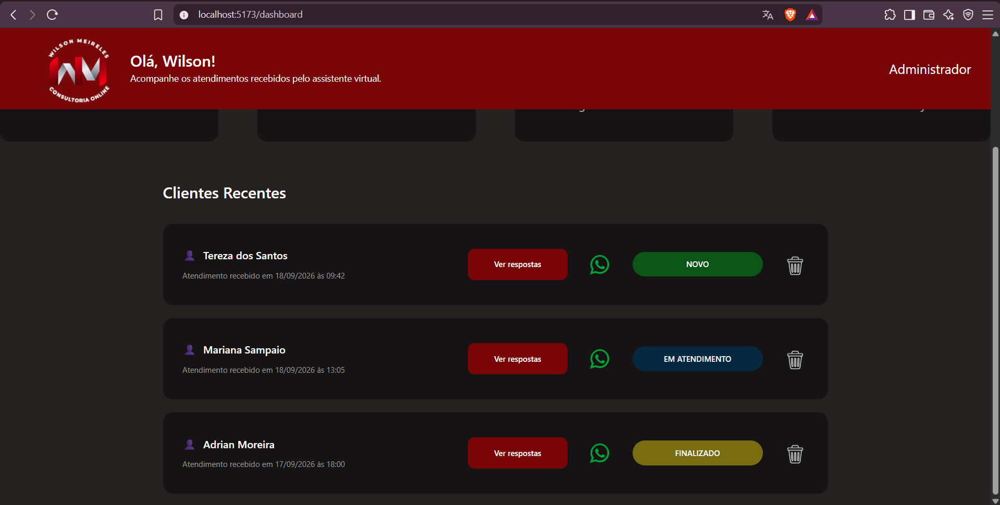
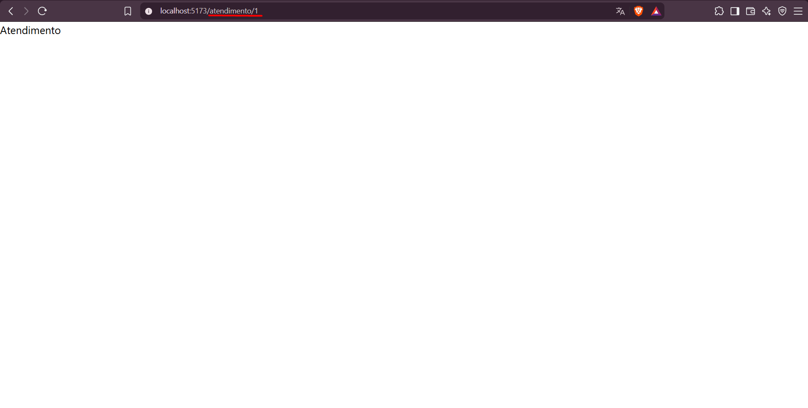

# Relatório de Testes — Issue #27

## 1. Identificação

- **Issue:** #27 — Implementar Dashboard de atendimentos
- **Issue de QA da validação inicial:** #60
- **Issue de QA do reteste:** #72 — QA — Retestar correções da issue #27
- **Branch testada:** `frontend/implementar+dashboard/27`
- **Commit da validação inicial:** `951b1b7`
- **Commit do reteste:** `d35af52` — `correção no dashboard`
- **Responsável pelos testes:** QA
- **Resultado final:** ✅ Aprovado após reteste

---

## 2. Objetivo

Validar a implementação do Dashboard de atendimentos desenvolvida na issue #27, verificando a inicialização da aplicação, a conformidade da interface com o protótipo, a utilização da camada de dados mockados e a navegação para os detalhes de um atendimento.

O reteste teve como objetivo verificar as correções dos dois defeitos funcionais identificados durante a validação inicial.

---

## 3. Critérios de Aceitação

Foram considerados os seguintes critérios definidos na issue #27:

- Layout fiel ao protótipo;
- Cards e lista renderizam dados mockados corretamente;
- Botão "Ver respostas" navega para `/atendimento/:id`.

Também foram considerados os elementos previstos na implementação:

- Saudação ao profissional;
- Quatro cards de estatísticas;
- Lista de clientes recentes com avatar, nome, status e data;
- Botão "Ver respostas" em cada cliente;
- Utilização de dados mockados.

---

## 4. Ambiente e Preparação

- Frontend executado localmente com Vite;
- URL utilizada: `http://localhost:5173/dashboard`;
- Branch da issue testada em detached HEAD;
- Aplicação iniciada com `npm run dev`;
- Protótipo do Figma utilizado como referência visual;
- Camada de mocks utilizada como referência para validação dos dados.

Para o reteste, foi utilizada a versão da branch correspondente ao commit `d35af52`.

---

## 5. Casos de Teste

### QA-027-01 — Inicialização do frontend

**Objetivo:**  
Verificar se o frontend inicia corretamente na branch da issue #27.

**Resultado esperado:**  
A aplicação deve iniciar sem erros e disponibilizar o frontend localmente.

**Resultado obtido:**  
O frontend iniciou corretamente e o Dashboard pôde ser acessado.

**Status:** ✅ Aprovado

---

### QA-027-02 — Layout e elementos do Dashboard

**Objetivo:**  
Verificar se o Dashboard apresenta os elementos previstos e mantém conformidade com o protótipo.

**Resultado esperado:**  
A tela deve apresentar a saudação ao profissional, quatro cards de estatísticas, lista de clientes recentes e as ações previstas.

**Resultado obtido:**  
Os elementos previstos foram apresentados e a estrutura geral da tela permaneceu compatível com o protótipo.

Foram observadas pequenas diferenças visuais em relação ao protótipo, principalmente nos avatares e em alguns espaçamentos/proporções, sem impedir a utilização da interface.

**Status:** ⚠️ Aprovado com observação

---

### QA-027-03 — Renderização dos dados mockados

**Objetivo:**  
Verificar se os cards e a lista de clientes utilizam corretamente a camada de dados mockados.

**Resultado esperado:**  
Os dados apresentados no Dashboard devem corresponder aos dados disponibilizados pela camada de mocks.

**Resultado obtido na validação inicial:**  
Os valores dos cards e os clientes apresentados no Dashboard estavam definidos diretamente na implementação e não correspondiam integralmente aos dados existentes em `mockApi.js`.

Foram observados no Dashboard clientes diferentes dos disponibilizados pela camada de mocks.

**Status da validação inicial:** ❌ Reprovado

---

### QA-027-04 — Navegação pelo botão "Ver respostas"

**Objetivo:**  
Verificar se o botão "Ver respostas" direciona o usuário para o atendimento correspondente.

**Resultado esperado:**  
Ao clicar em "Ver respostas", a aplicação deve navegar para `/atendimento/:id`, utilizando o identificador correspondente ao atendimento selecionado.

**Resultado obtido na validação inicial:**  
Ao clicar em "Ver respostas", a aplicação exibia apenas um alerta com a mensagem "Ver respostas" e permanecia no Dashboard.

**Status da validação inicial:** ❌ Reprovado

---

## 5.1 Reteste

### Reteste — QA-027-03 — Renderização dos dados mockados

**Objetivo:**  
Verificar se o Dashboard passou a utilizar corretamente os dados provenientes da camada de mocks.

**Commit do reteste:** `d35af52` — `correção no dashboard`

**Procedimento:**
1. Executar a versão atualizada da branch `frontend/implementar+dashboard/27`.
2. Acessar `/dashboard`.
3. Verificar os clientes apresentados na lista.
4. Comparar os dados apresentados com os dados da camada de mocks.

**Resultado esperado:**  
O Dashboard deve apresentar os dados disponibilizados pela camada de mocks.

**Resultado obtido:**  
O Dashboard passou a apresentar os clientes correspondentes aos dados mockados:

- Tereza dos Santos — `NOVO`;
- Mariana Sampaio — `EM ATENDIMENTO`;
- Adrian Moreira — `FINALIZADO`.

Os dados exibidos passaram a corresponder aos dados utilizados pela camada de mocks.

O defeito `DEF-027-01` foi considerado corrigido.

**Status:** ✅ Aprovado no reteste

**Evidência:**

---

### Reteste — QA-027-04 — Navegação pelo botão "Ver respostas"

**Objetivo:**  
Verificar se o botão "Ver respostas" passou a realizar a navegação prevista para o detalhe do atendimento.

**Commit do reteste:** `d35af52` — `correção no dashboard`

**Procedimento:**
1. Acessar `/dashboard`.
2. Localizar o atendimento de Tereza dos Santos.
3. Clicar no botão "Ver respostas".
4. Verificar a URL acessada após a ação.

**Resultado esperado:**  
A aplicação deve navegar para a rota correspondente ao atendimento selecionado, no formato `/atendimento/:id`.

**Resultado obtido:**  
Ao clicar em "Ver respostas" no atendimento de Tereza dos Santos, a aplicação navegou corretamente para `/atendimento/1`.

O alerta apresentado na implementação anterior não foi mais exibido e o defeito `DEF-027-02` foi considerado corrigido.

**Status:** ✅ Aprovado no reteste

**Evidência:**

---

## 6. Resumo dos Resultados

| Caso | Descrição | Validação inicial | Resultado após reteste |
|---|---|---|---|
| QA-027-01 | Inicialização do frontend | ✅ Aprovado | ✅ Aprovado |
| QA-027-02 | Layout e elementos do Dashboard | ⚠️ Aprovado com observação | ⚠️ Aprovado com observação |
| QA-027-03 | Renderização dos dados mockados | ❌ Reprovado | ✅ Aprovado no reteste |
| QA-027-04 | Navegação pelo botão "Ver respostas" | ❌ Reprovado | ✅ Aprovado no reteste |

**Casos da validação inicial:** 4  
**Casos retestados:** 2  
**Defeitos funcionais identificados inicialmente:** 2  
**Defeitos funcionais pendentes após o reteste:** 0  
**Observações visuais:** 1

**Resultado final:** ✅ Aprovado após reteste, mantendo uma observação visual não bloqueante.

---

## 7. Defeitos e Observações

### DEF-027-01 — Dashboard não utiliza corretamente a camada de dados mockados

**Situação inicial:**  
Os valores e dados dos clientes apresentados no Dashboard estavam definidos diretamente na implementação e não correspondiam integralmente aos dados existentes na camada de mocks.

**Impacto:** Alto.

**Situação após reteste:** ✅ Corrigido.

No commit `d35af52`, o Dashboard passou a apresentar os clientes provenientes da camada de dados mockados, incluindo Tereza dos Santos, Mariana Sampaio e Adrian Moreira.

---

### DEF-027-02 — Botão "Ver respostas" não realiza navegação

**Situação inicial:**  
Ao clicar no botão "Ver respostas", era exibido apenas um alerta e a aplicação permanecia em `/dashboard`.

**Impacto:** Alto.

**Situação após reteste:** ✅ Corrigido.

No commit `d35af52`, o botão passou a navegar corretamente para a rota `/atendimento/:id`. Durante o reteste com o atendimento de Tereza dos Santos, a aplicação foi direcionada para `/atendimento/1`.

---

### OBS-027-01 — Diferenças visuais em relação ao protótipo

Na validação inicial foram observadas pequenas diferenças visuais, principalmente nos avatares e em alguns espaçamentos/proporções.

As diferenças não impedem o funcionamento da interface e não foram classificadas como defeito funcional.

**Situação:** ⚠️ Observação não bloqueante.

---

## 8. Considerações Finais

Na validação inicial da issue #27, os testes identificaram dois defeitos funcionais: o Dashboard não utilizava corretamente a camada de dados mockados e o botão "Ver respostas" não realizava a navegação prevista para `/atendimento/:id`.

No reteste realizado no commit `d35af52`, foi confirmado que ambos os problemas foram corrigidos.

O Dashboard passou a apresentar os clientes correspondentes aos dados mockados e o botão "Ver respostas" passou a navegar corretamente para o detalhe do atendimento selecionado.

A observação visual registrada anteriormente permanece classificada como não bloqueante e não compromete o funcionamento dos critérios funcionais da issue.

Não permanecem defeitos funcionais pendentes identificados pela QA no escopo da issue #27.

**Resultado final da validação: ✅ Aprovado após reteste, com observação visual não bloqueante.**
