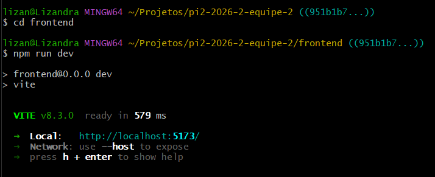
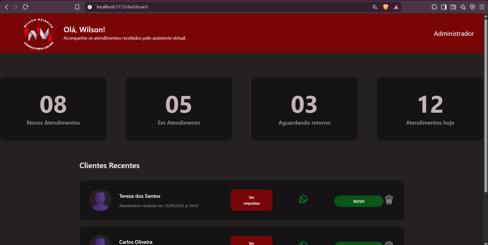
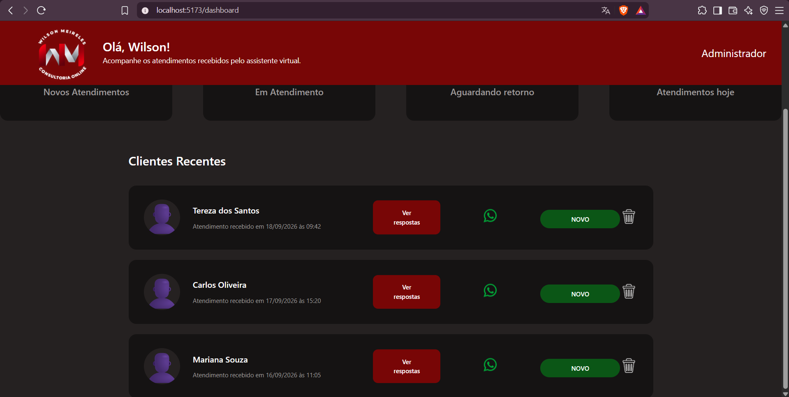
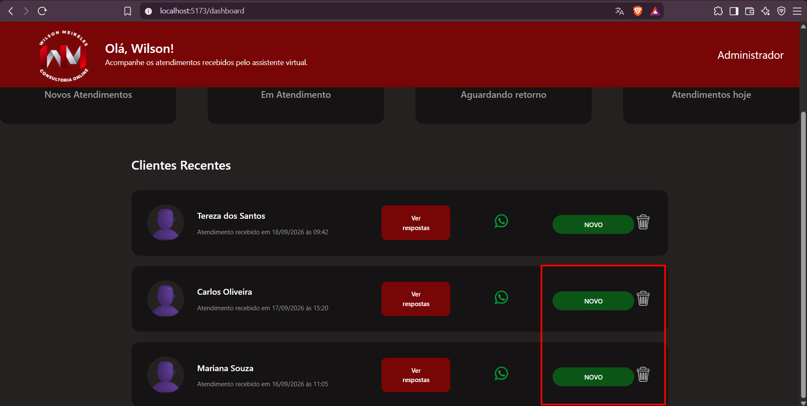
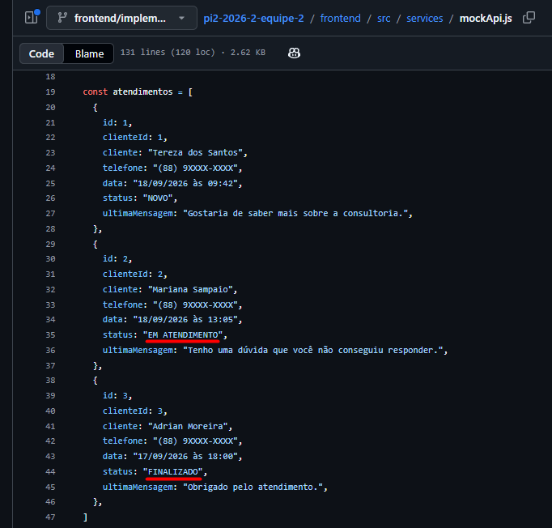
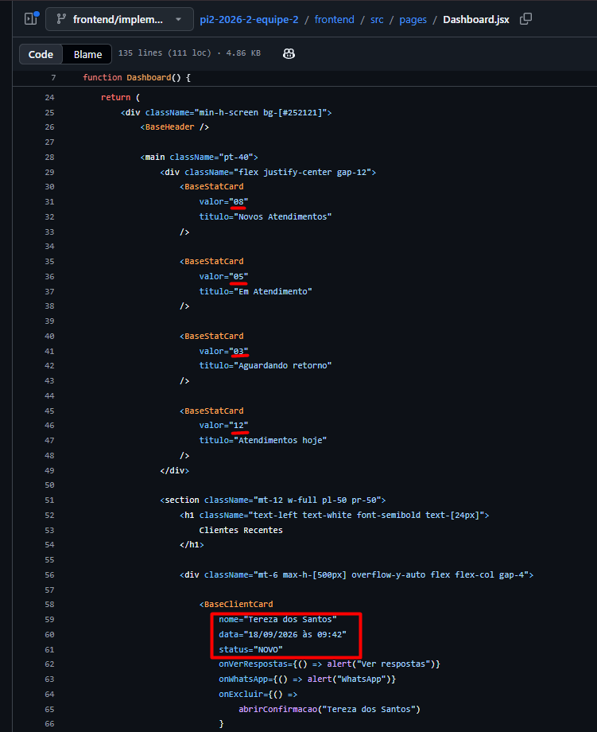
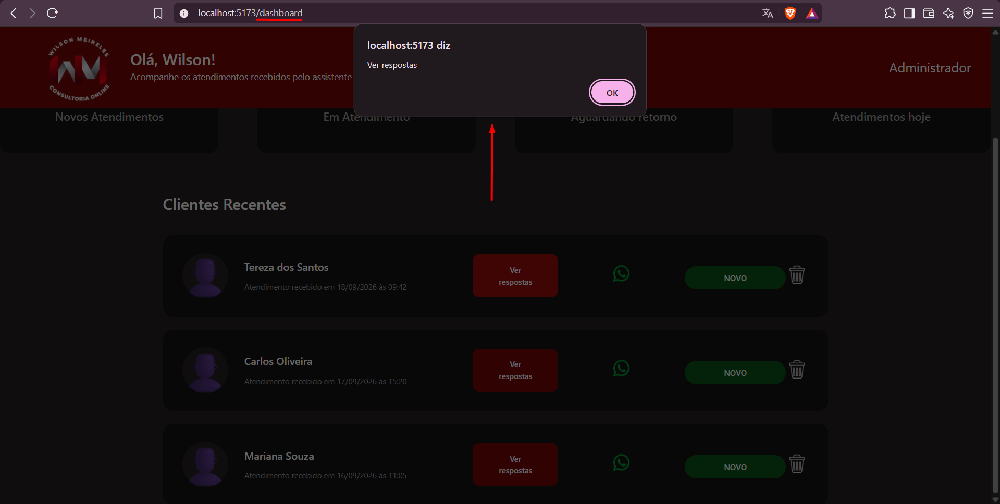

# Relatório de Testes — Issue #27

## 1. Identificação

- **Issue:** #27 — Implementar Dashboard de atendimentos
- **Issue de QA:** #60 — QA — Validar implementação do Dashboard de atendimentos (#27)
- **Requisito relacionado:** RF020 — Dashboard administrativo
- **Branch testada:** `frontend/implementar+dashboard/27`
- **Commit testado:** `951b1b7`
- **Responsável pelos testes:** QA
- **Resultado final:** Reprovado — necessita correções

---

## 2. Objetivo

Validar a implementação do Dashboard de atendimentos desenvolvida na issue #27,
verificando os critérios de aceitação definidos, a renderização dos dados,
a navegação para os atendimentos e a conformidade visual com o protótipo
disponibilizado pela equipe de Design.

---

## 3. Critérios de Aceitação

Foram considerados os seguintes critérios definidos na issue #27:

- Layout fiel ao protótipo;
- Cards e lista renderizam dados mockados corretamente;
- Botão "Ver respostas" navega para `/atendimento/:id`.

Também foram verificados os elementos previstos na implementação:

- Saudação ao profissional ("Olá, Wilson!");
- Quatro cards de estatísticas;
- Lista de clientes recentes;
- Avatar, nome, status e data dos clientes;
- Botão "Ver respostas" em cada cliente.

---

## 4. Ambiente e Preparação

- Frontend executado localmente com Vite;
- URL utilizada: `http://localhost:5173/dashboard`;
- Branch da issue testada em detached HEAD;
- Aplicação iniciada com `npm run dev`;
- Protótipo do Figma utilizado como referência visual;
- `mockApi.js` utilizado como referência para validação dos dados mockados.

---

## 5. Casos de Teste

### QA-027-01 — Inicialização do frontend

**Objetivo:**  
Verificar se o frontend inicia corretamente na branch da issue #27.

**Procedimento:**  
1. Acessar a pasta `frontend`.
2. Executar `npm run dev`.

**Resultado esperado:**  
O frontend deve iniciar sem erros e disponibilizar a aplicação localmente.

**Resultado obtido:**  
O frontend iniciou corretamente pelo Vite, sem erros de inicialização, e a aplicação foi disponibilizada em `http://localhost:5173/`.

**Status:** ✅ Aprovado

**Evidência:**  

---

### QA-027-02 — Layout e elementos do Dashboard

**Objetivo:**  
Verificar se o Dashboard apresenta os elementos previstos na issue #27 e mantém conformidade visual com o protótipo.

**Procedimento:**  
1. Acessar `/dashboard`.
2. Comparar a tela implementada com o protótipo disponibilizado pela equipe de Design.
3. Verificar a saudação apresentada no cabeçalho.
4. Verificar a presença dos quatro cards de estatísticas.
5. Verificar a seção "Clientes Recentes".
6. Verificar a exibição de avatar, nome, data e status dos clientes.

**Resultado esperado:**  
O Dashboard deve apresentar a saudação "Olá, Wilson!", quatro cards de estatísticas e uma lista de clientes recentes contendo avatar, nome, data e status, mantendo o layout de acordo com o protótipo.

**Resultado obtido:**  
O Dashboard apresentou a saudação "Olá, Wilson!", os quatro cards de estatísticas e a seção "Clientes Recentes".

Os clientes exibidos apresentam avatar, nome, data do atendimento e status. A estrutura geral da interface está de acordo com o protótipo.

Foram observadas pequenas diferenças visuais entre o protótipo e a implementação, como a representação do avatar dos clientes e alguns espaçamentos/proporções dos elementos, sem comprometer a utilização da interface.

**Status:** ⚠️ Aprovado com observação

**Evidências:**  

---

### QA-027-03 — Renderização dos dados mockados

**Objetivo:**  
Verificar se os cards e a lista de clientes do Dashboard utilizam e renderizam corretamente os dados disponibilizados pela camada de mock.

**Procedimento:**  
1. Acessar `/dashboard`.
2. Verificar os clientes, datas e status apresentados na seção "Clientes Recentes".
3. Comparar os dados exibidos com os dados definidos em `src/services/mockApi.js`.
4. Verificar se a interface está utilizando corretamente os dados da camada de mock.
5. Verificar a origem dos valores apresentados nos cards e na lista de clientes.

**Resultado esperado:**  
O Dashboard deve utilizar os dados disponibilizados pela camada de mock e renderizar corretamente as informações dos atendimentos e clientes.

**Resultado obtido:**  
Os dados exibidos no Dashboard não correspondem integralmente aos dados definidos em `mockApi.js`.

Na camada de mock estão definidos os seguintes atendimentos:

- Tereza dos Santos — 18/09/2026 às 09:42 — NOVO;
- Mariana Sampaio — 18/09/2026 às 13:05 — EM ATENDIMENTO;
- Adrian Moreira — 17/09/2026 às 18:00 — FINALIZADO.

Na interface foram exibidos:

- Tereza dos Santos — 18/09/2026 às 09:42 — NOVO;
- Carlos Oliveira — 17/09/2026 às 15:20 — NOVO;
- Mariana Souza — 16/09/2026 às 11:05 — NOVO.

Apenas os dados de Tereza dos Santos correspondem aos dados da camada de mock.

Além da divergência entre os dados exibidos e os dados definidos em
`mockApi.js`, foi verificado em `Dashboard.jsx` que os valores dos quatro
cards de estatísticas e os dados dos clientes estão definidos diretamente
no componente.

Não foi identificada utilização da camada `mockApi.js` para obtenção
dos dados apresentados no Dashboard.

**Status:** ❌ Reprovado

**Evidências:**  

---

### QA-027-04 — Navegação pelo botão "Ver respostas"

**Objetivo:**  
Verificar se o botão "Ver respostas" direciona o usuário para a página de atendimento correspondente ao cliente selecionado.

**Procedimento:**  
1. Acessar `/dashboard`.
2. Localizar um cliente na seção "Clientes Recentes".
3. Clicar no botão "Ver respostas" do cliente Tereza dos Santos.
4. Verificar o comportamento da aplicação e a rota acessada.

**Resultado esperado:**  
Ao clicar em "Ver respostas", o sistema deve navegar para a rota `/atendimento/:id`, utilizando o identificador correspondente ao atendimento selecionado.

**Resultado obtido:**  
Ao clicar no botão "Ver respostas", foi exibido apenas um alerta com a mensagem "Ver respostas".

A aplicação permaneceu na rota `/dashboard` e não realizou a navegação para `/atendimento/:id`.

**Status:** ❌ Reprovado

**Evidência:**  

---

## 6. Resumo dos Resultados

| Caso | Descrição | Resultado |
|---|---|---|
| QA-027-01 | Inicialização do frontend | ✅ Aprovado |
| QA-027-02 | Layout e elementos do Dashboard | ⚠️ Aprovado com observação |
| QA-027-03 | Renderização dos dados mockados | ❌ Reprovado |
| QA-027-04 | Navegação pelo botão "Ver respostas" | ❌ Reprovado |

**Total de casos executados:** 4  
**Aprovados:** 1  
**Aprovados com observação:** 1  
**Reprovados:** 2  
**Defeitos funcionais encontrados:** 2  
**Observações visuais:** 1

---

## 7. Defeitos e Observações

### DEF-027-01 — Dashboard não utiliza corretamente a camada de dados mockados

Os cards de estatísticas e os dados apresentados na lista de clientes estão definidos diretamente em `Dashboard.jsx`.

Os clientes apresentados na interface também não correspondem integralmente aos atendimentos existentes em `mockApi.js`.

**Impacto:** Alto.

**Critério afetado:**  
"Cards e lista renderizam dados mockados corretamente."

**Recomendação:**  
Utilizar a camada de serviços/mocks existente para obter os dados do Dashboard, evitando manter os valores dos cards e os dados dos clientes definidos diretamente no componente.

---

### DEF-027-02 — Botão "Ver respostas" não navega para o atendimento

Ao clicar no botão "Ver respostas", a aplicação apresenta apenas um alerta e permanece na rota `/dashboard`.

**Impacto:** Alto.

**Critério afetado:**  
"Botão 'Ver respostas' navega para `/atendimento/:id`."

**Recomendação:**  
Implementar a navegação utilizando o identificador do atendimento selecionado, direcionando o usuário para a rota `/atendimento/:id`.

---

### OBS-027-01 — Pequenas divergências visuais em relação ao protótipo

Foram identificadas pequenas diferenças entre a implementação e o protótipo, principalmente na representação visual dos avatares e em alguns espaçamentos e proporções dos elementos.

As diferenças observadas não impedem a utilização do Dashboard.

**Impacto:** Baixo.

**Recomendação:**  
Realizar ajustes visuais para aumentar a fidelidade da implementação em relação ao protótipo.

---

## 8. Considerações Finais

A implementação da issue #27 apresenta corretamente a estrutura principal do Dashboard, incluindo a saudação ao profissional, os quatro cards de estatísticas e a lista de clientes recentes.

Entretanto, foram identificados dois problemas que afetam diretamente os critérios de aceitação da issue.

O Dashboard não está utilizando corretamente a camada de dados mockados, mantendo os valores dos cards e os dados dos clientes definidos diretamente em `Dashboard.jsx`. Além disso, o botão "Ver respostas" não realiza a navegação prevista para `/atendimento/:id`.

Também foram observadas pequenas divergências visuais em relação ao protótipo, sem impacto significativo no uso da interface.

Como dois critérios de aceitação funcionais não foram atendidos, a implementação necessita de correções e nova validação de QA.

**Resultado final da validação: ❌ Reprovado — necessita correções.**
