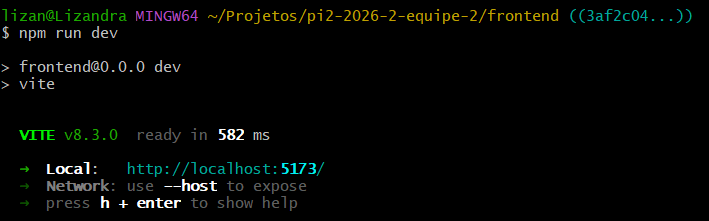
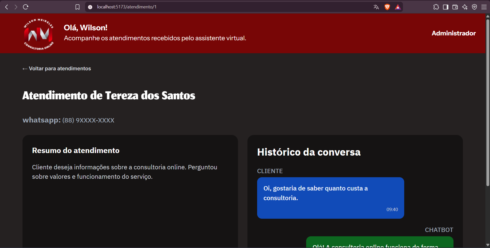
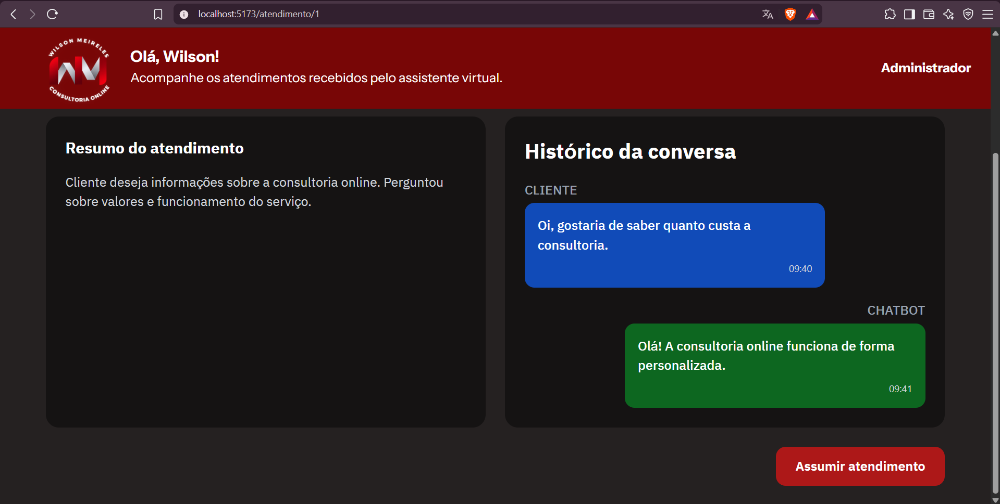
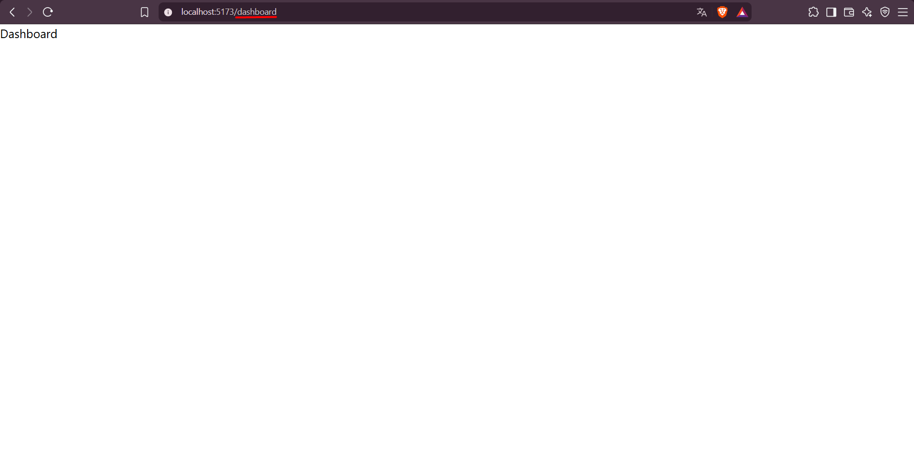
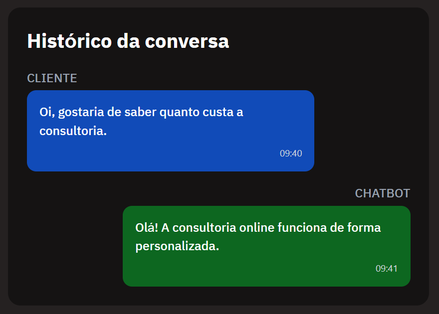
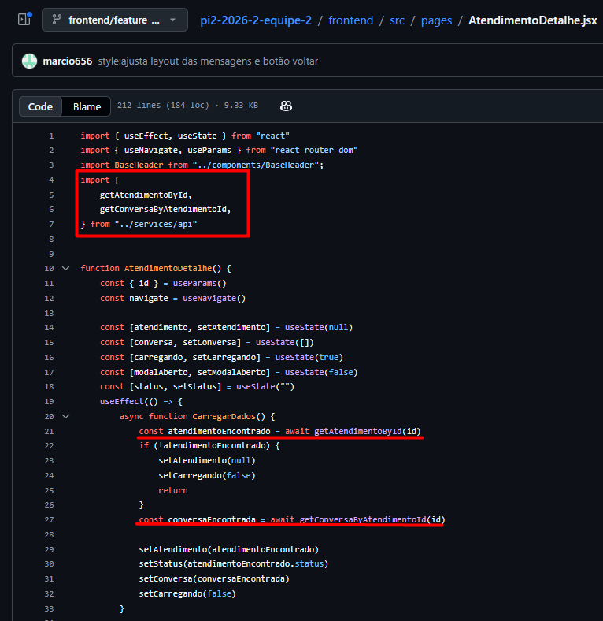
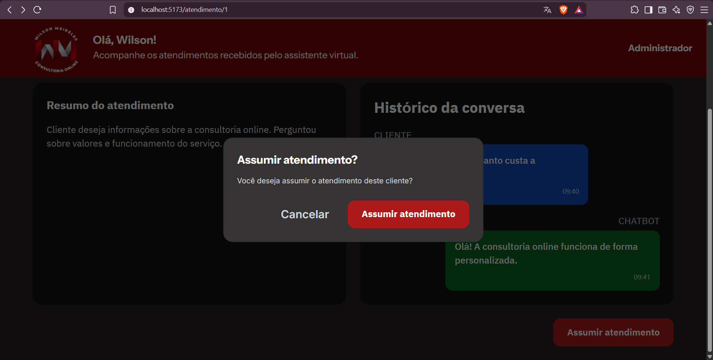
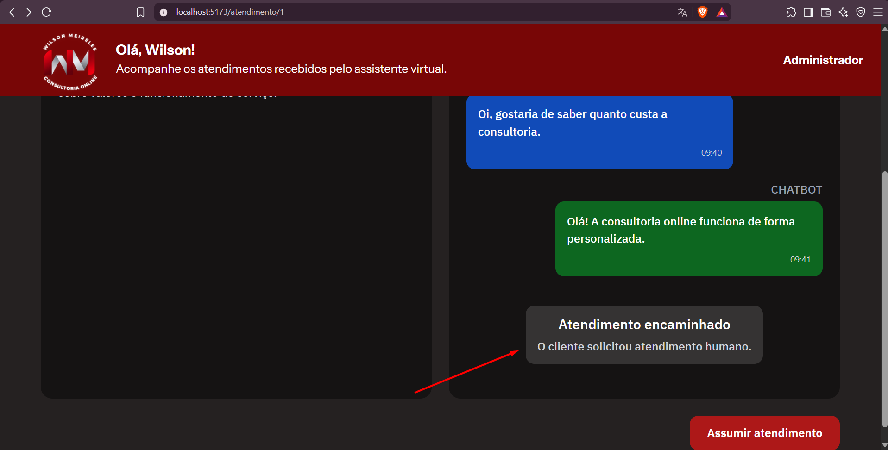
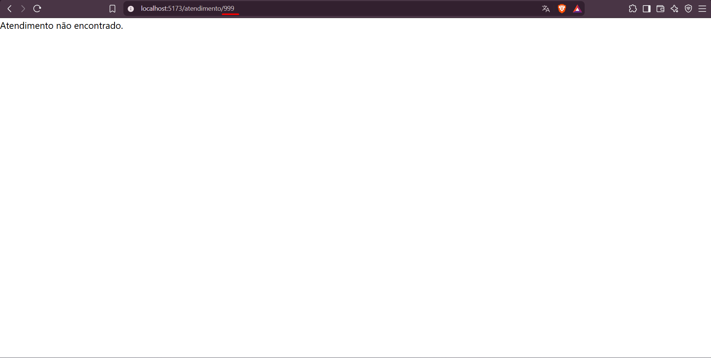

# Relatório de Testes — Issue #28

## 1. Identificação

**Issue:** #28 — Implementar tela de Detalhe do Atendimento  
**Branch testada:** `frontend/feature-atendimentos`  
**Commit testado:** `3af2c04`  
**Responsável pelo desenvolvimento:** marcio656  
**Responsável pelos testes:** QA  
**Status final:** ✅ Aprovado

---

## 2. Objetivo

Validar a implementação da tela de detalhe do atendimento, verificando a
exibição das informações do cliente, resumo do atendimento, histórico da
conversa, utilização dos dados mockados, navegação e ação de assumir
atendimento.

---

## 3. Critérios de aceitação avaliados

Foram considerados os critérios definidos na issue #28:

- Layout fiel ao protótipo.
- Histórico renderizado corretamente com diferenciação visual.
- Botão "Voltar" navega para `/dashboard`.

Também foram verificadas as tarefas relacionadas à tela:

- Botão "Voltar para atendimentos".
- Cabeçalho com nome e telefone do cliente.
- Bloco "Resumo do atendimento".
- Histórico da conversa em formato de mensagens.
- Botão "Assumir atendimento".
- Utilização dos dados mockados.

---

## 4. Ambiente e preparação

**Ambiente utilizado:**
- Frontend React + Vite.
- Navegador web em ambiente local.
- Camada de serviços utilizando dados mockados.

**Preparação:**

A branch da issue foi acessada em modo detached por meio dos comandos:

`git fetch origin`

`git switch --detach origin/frontend/feature-atendimentos`

O frontend foi iniciado utilizando:

`npm run dev`

A aplicação foi acessada através do ambiente local disponibilizado pelo Vite.

---

## 5. Casos de teste executados

### QA-028-01 — Inicialização do frontend

**Objetivo:**  
Verificar se o frontend inicia corretamente na branch da issue #28.

**Procedimento:**  
1. Acessar a pasta `frontend`.
2. Executar `npm run dev`.

**Resultado esperado:**  
O frontend deve iniciar sem erros e disponibilizar a aplicação localmente.

**Resultado obtido:**  
O frontend iniciou corretamente pelo Vite, sem erros de inicialização, e a
aplicação foi disponibilizada em `http://localhost:5173/`.

**Status:** ✅ Aprovado

**Evidência:**

---

### QA-028-02 — Renderização da tela de detalhe do atendimento

**Objetivo:**  
Verificar se a tela de detalhe do atendimento apresenta os elementos
previstos na issue #28.

**Procedimento:**  
1. Acessar `/atendimento/1`.
2. Aguardar o carregamento da página.
3. Verificar as informações e os componentes apresentados na tela.

**Resultado esperado:**  
A tela deve apresentar:

- identificação do cliente;
- telefone do cliente;
- bloco "Resumo do atendimento";
- histórico da conversa;
- diferenciação visual entre mensagens do cliente e do chatbot;
- botão "Assumir atendimento";
- opção "Voltar para atendimentos".

**Resultado obtido:**  
A tela foi carregada corretamente para o atendimento de Tereza dos Santos.

Foram apresentados o nome e telefone da cliente, o bloco "Resumo do
atendimento", o histórico da conversa, as mensagens do cliente e do chatbot
com diferenciação visual, o botão "Assumir atendimento" e a opção
"Voltar para atendimentos".

A disposição dos elementos apresentou-se compatível com o protótipo
utilizado como referência.

**Status:** ✅ Aprovado

**Evidências:**

---

### QA-028-03 — Navegação pelo botão "Voltar para atendimentos"

**Objetivo:**  
Verificar se o botão "Voltar para atendimentos" direciona o usuário para
o Dashboard.

**Procedimento:**  
1. Acessar `/atendimento/1`.
2. Clicar em "Voltar para atendimentos".
3. Verificar a rota acessada.

**Resultado esperado:**  
A aplicação deve navegar para `/dashboard`.

**Resultado obtido:**  
Ao clicar em "Voltar para atendimentos", a aplicação navegou corretamente
para `/dashboard`.

A tela exibida contém apenas o conteúdo básico da rota nesta branch, o que
não interfere na validação do redirecionamento previsto pela issue #28.

**Status:** ✅ Aprovado

**Evidência:**

---

### QA-028-04 — Utilização dos dados mockados no detalhe do atendimento

**Objetivo:**  
Verificar se a tela de detalhe utiliza a camada de serviços para obter os
dados do atendimento e o histórico da conversa.

**Procedimento:**  
1. Acessar `/atendimento/1`.
2. Verificar os dados apresentados para o atendimento.
3. Comparar o histórico exibido com os dados disponíveis na camada de mock.
4. Verificar no código da tela a origem dos dados utilizados.

**Resultado esperado:**  
A tela deve obter os dados do atendimento e da conversa por meio da camada
de serviços, renderizando as informações correspondentes ao identificador
informado na rota.

**Resultado obtido:**  
A tela utilizou as funções `getAtendimentoById(id)` e
`getConversaByAtendimentoId(id)` disponibilizadas pela camada
`services/api`.

Para o atendimento de ID 1, foram apresentados corretamente os dados de
Tereza dos Santos e as mensagens existentes na camada de mock, incluindo
remetente, conteúdo e horário.

O histórico é renderizado dinamicamente a partir dos dados retornados pela
camada de serviços.

**Status:** ✅ Aprovado

**Evidências:**

---

### QA-028-05 — Assumir atendimento

**Objetivo:**  
Verificar o funcionamento da ação "Assumir atendimento".

**Procedimento:**  
1. Acessar `/atendimento/1`.
2. Clicar em "Assumir atendimento".
3. Verificar a exibição do modal de confirmação.
4. Clicar em "Cancelar".
5. Verificar se o modal é fechado sem realizar a ação.
6. Abrir novamente o modal.
7. Confirmar a ação "Assumir atendimento".

**Resultado esperado:**  
O sistema deve solicitar confirmação antes de assumir o atendimento.

Ao cancelar, nenhuma alteração deve ser realizada.

Ao confirmar, o atendimento deve ser assumido e o modal deve ser fechado.

**Resultado obtido:**  
O modal de confirmação foi exibido corretamente.

Ao selecionar "Cancelar", o modal foi fechado sem realizar a ação.

Ao confirmar "Assumir atendimento", o modal foi fechado e a ação foi
processada pela interface, com atualização do estado do atendimento.

**Status:** ✅ Aprovado

**Evidências:**

---

### QA-028-06 — Acesso a atendimento inexistente

**Objetivo:**  
Verificar o comportamento da aplicação ao acessar um identificador de
atendimento inexistente.

**Procedimento:**  
1. Acessar `/atendimento/999`.
2. Aguardar o carregamento da página.
3. Verificar o comportamento apresentado.

**Resultado esperado:**  
A aplicação deve tratar a ausência do atendimento sem apresentar erro de
execução ao usuário.

**Resultado obtido:**  
Ao acessar um identificador inexistente, a aplicação exibiu a mensagem
"Atendimento não encontrado.", tratando corretamente a ausência de dados.

**Status:** ✅ Aprovado

**Evidência:**

---

## 6. Resumo dos resultados

| Caso de teste | Resultado |
|---|---|
| QA-028-01 — Inicialização do frontend | ✅ Aprovado |
| QA-028-02 — Renderização da tela | ✅ Aprovado |
| QA-028-03 — Navegação para o Dashboard | ✅ Aprovado |
| QA-028-04 — Utilização dos dados mockados | ✅ Aprovado |
| QA-028-05 — Assumir atendimento | ✅ Aprovado |
| QA-028-06 — Atendimento inexistente | ✅ Aprovado |

**Total:** 6 casos executados  
**Aprovados:** 6  
**Reprovados:** 0

---

## 7. Defeitos e observações

Não foram identificados defeitos funcionais bloqueantes durante a execução
dos testes da issue #28.

A tela utiliza corretamente a camada de serviços para obtenção dos dados
mockados do atendimento e do histórico da conversa.

A rota `/dashboard` disponível na branch testada apresenta apenas seu
conteúdo básico. Essa condição não foi considerada defeito da issue #28,
pois o redirecionamento realizado pelo botão "Voltar para atendimentos"
ocorreu corretamente e a implementação completa do Dashboard pertence a
outra atividade.

---

## 8. Considerações finais

A implementação da issue #28 apresentou funcionamento compatível com os
critérios de aceitação avaliados.

A tela de detalhe apresentou as informações do cliente, resumo e histórico
da conversa com diferenciação visual, utilizou a camada de dados mockados,
realizou corretamente a navegação para o Dashboard e disponibilizou o fluxo
de confirmação para assumir o atendimento.

Também foi verificado o tratamento de um identificador de atendimento
inexistente, sem ocorrência de erro de execução.

**Resultado final da validação: ✅ Aprovado.**
