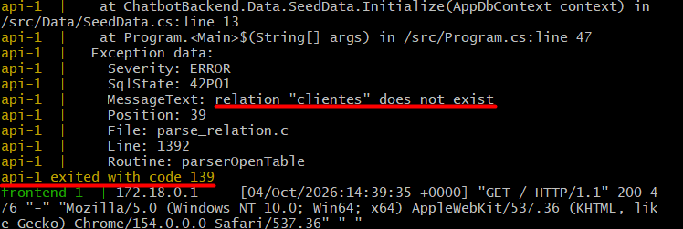
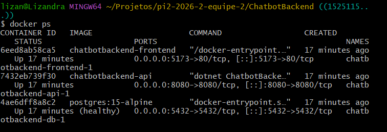
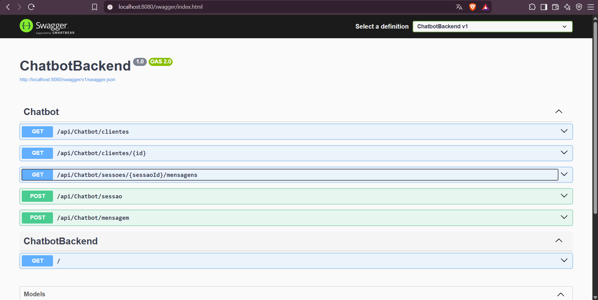
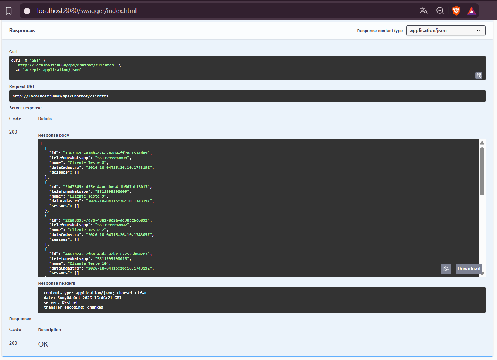

# Relatório de Validação — Issue #53

## 1. Identificação

- **Issue:** #53 — Conteinerização do backend
- **Branch testada:** `conteinarização/fluxoderotas`
- **Responsável pelo desenvolvimento:** Doloradado
- **Responsável pela validação:** QA
- **Commit inicialmente testado:** `c698635`
- **Commit do reteste:** `1525115`
- **Resultado inicial:** Reprovado
- **Resultado após reteste:** Aprovado

---

## 2. Objetivo da validação

Validar a conteinerização do backend da aplicação, verificando se os serviços necessários são inicializados corretamente através do Docker e se a API consegue se comunicar com o banco de dados PostgreSQL.

Também foi realizado reteste após a correção de um problema identificado durante a primeira execução.

---

## 3. Escopo da validação

Foram verificados:

- Inicialização dos serviços através do Docker Compose;
- Execução do container da API;
- Execução e estado do container PostgreSQL;
- Disponibilidade da API através do Swagger;
- Comunicação entre API e banco de dados;
- Consulta de dados do banco através da API;
- Funcionamento do ambiente após a correção da falha encontrada durante a validação.

---

## 4. Ambiente e preparação

- **Sistema operacional:** Windows
- **Docker:** Docker Desktop
- **Banco de dados:** PostgreSQL 15 Alpine
- **Backend:** .NET
- **Branch:** `conteinarização/fluxoderotas`
- **Diretório de execução:** `ChatbotBackend`

Comando utilizado para inicialização:

```bash
docker compose up --build
```

Após a correção, o ambiente também foi recriado utilizando:

```bash
docker compose down -v
docker compose up --build
```

Para verificar o estado dos containers:

```bash
docker ps
```

---

## 5. Casos de teste

### QA-053-01 — Inicialização do backend através do Docker Compose

**Objetivo:**  
Verificar se o backend e os serviços necessários são inicializados corretamente através do Docker Compose.

**Procedimento:**
1. Acessar o diretório `ChatbotBackend`.
2. Executar `docker compose up --build`.
3. Acompanhar a inicialização dos containers.
4. Verificar se a API e o banco de dados permanecem em execução.

**Resultado esperado:**  
Os serviços necessários devem ser inicializados e permanecer em execução sem erros que impeçam o funcionamento do backend.

**Resultado obtido inicialmente:**  
O banco de dados PostgreSQL foi inicializado, porém a API encerrou durante a inicialização ao tentar consultar a tabela `clientes`.

Foi apresentado o erro:

`42P01: relation "clientes" does not exist`

A exceção ocorreu durante a execução do `SeedData.Initialize`, impedindo que a API permanecesse disponível.

**Status inicial:** ❌ Reprovado

**Evidência da falha inicial:**



#### Reteste

Após a correção disponibilizada no commit `1525115`, os containers e o volume anterior foram removidos e o ambiente foi criado novamente.

No reteste, os containers permaneceram em execução:

- `chatbotbackend-api-1` — **Up**
- `chatbotbackend-db-1` — **Up (healthy)**
- `chatbotbackend-frontend-1` — **Up**

A API permaneceu ativa após a inicialização e o banco de dados apresentou estado saudável.

**Status após reteste:** ✅ Aprovado

**Evidência do reteste:**



---

### QA-053-02 — Disponibilidade da API através do Swagger

**Objetivo:**  
Verificar se a API permanece disponível após a inicialização dos containers.

**Procedimento:**
1. Manter os containers em execução.
2. Acessar o Swagger através da porta `8080`.
3. Verificar o carregamento da documentação da API.
4. Verificar a disponibilidade dos endpoints.

**Resultado esperado:**  
O Swagger deve ser carregado corretamente e apresentar os endpoints disponibilizados pelo backend.

**Resultado obtido:**  
O Swagger foi carregado normalmente e apresentou os endpoints da API, incluindo rotas relacionadas a clientes, sessões e mensagens.

**Status:** ✅ Aprovado

**Evidência:**



---

### QA-053-03 — Comunicação entre backend e banco de dados

**Objetivo:**  
Verificar se o backend consegue consultar os dados armazenados no PostgreSQL.

**Procedimento:**
1. Acessar o Swagger.
2. Executar o endpoint `GET /api/Chatbot/clientes`.
3. Verificar o código HTTP retornado.
4. Verificar os dados presentes na resposta.

**Resultado esperado:**  
A API deve consultar o banco de dados sem erros e retornar os clientes cadastrados.

**Resultado obtido:**  
A requisição retornou **HTTP 200 OK** e apresentou registros de clientes cadastrados no banco, contendo informações como identificador, telefone, nome e data de cadastro.

A consulta confirmou que a API estava conseguindo acessar os dados do PostgreSQL após a correção.

**Status:** ✅ Aprovado

**Evidência:**



---

## 6. Resumo da execução

| Caso | Descrição | Resultado |
|---|---|---|
| QA-053-01 | Inicialização do backend através do Docker Compose | ❌ Reprovado → ✅ Aprovado no reteste |
| QA-053-02 | Disponibilidade da API através do Swagger | ✅ Aprovado |
| QA-053-03 | Comunicação entre backend e banco de dados | ✅ Aprovado |

**Casos de teste:** 3  
**Aprovados após conclusão da validação:** 3  
**Defeitos identificados:** 1  
**Defeitos pendentes:** 0  
**Resultado final:** ✅ Aprovado após reteste

---

## 7. Defeitos e observações

### DEF-053-01 — API encerrava durante a inicialização

**Descrição:**  
Na primeira execução do ambiente, o container da API conseguiu estabelecer comunicação com o PostgreSQL, porém a aplicação tentou consultar a tabela `clientes` antes que ela estivesse disponível.

O erro apresentado foi:

`42P01: relation "clientes" does not exist`

Como consequência, o processo da API foi encerrado e o serviço ficou indisponível.

**Impacto:** Alto — impedia a inicialização e utilização do backend.

**Status:** ✅ Corrigido

A correção foi disponibilizada no commit `1525115` (`fix: correção do problema de inicialização do dockerbuild`).

Após a correção, o ambiente foi recriado e o teste executado novamente. A API permaneceu ativa, o PostgreSQL apresentou estado `healthy` e consultas ao banco puderam ser realizadas normalmente.

### Observação

Durante a execução do Docker Compose foi apresentado um aviso informando que o atributo `version` presente no arquivo `docker-compose.yml` está obsoleto e será ignorado pela versão atual do Docker Compose.

O aviso não impediu a inicialização ou o funcionamento dos serviços e, portanto, não foi classificado como defeito funcional.

---

## 8. Considerações finais

A primeira validação da conteinerização do backend identificou uma falha que impedia a permanência da API em execução devido à tentativa de acesso à tabela `clientes` antes de sua disponibilidade no banco de dados.

Após a correção realizada pelo desenvolvedor, foi executado um reteste utilizando um ambiente recriado. Os containers permaneceram ativos, o PostgreSQL apresentou estado saudável e o Swagger ficou disponível.

Também foi realizada uma consulta através do endpoint `GET /api/Chatbot/clientes`, que retornou **HTTP 200 OK** e os registros armazenados no banco, confirmando a comunicação entre backend e PostgreSQL.

Dessa forma, considerando o resultado do reteste, a implementação da issue #53 encontra-se:

**✅ APROVADA APÓS RETESTE**
