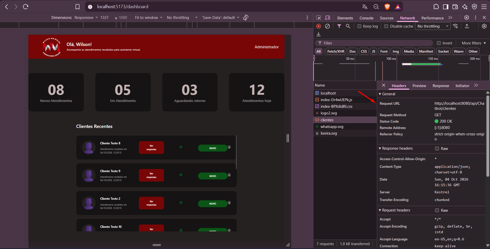
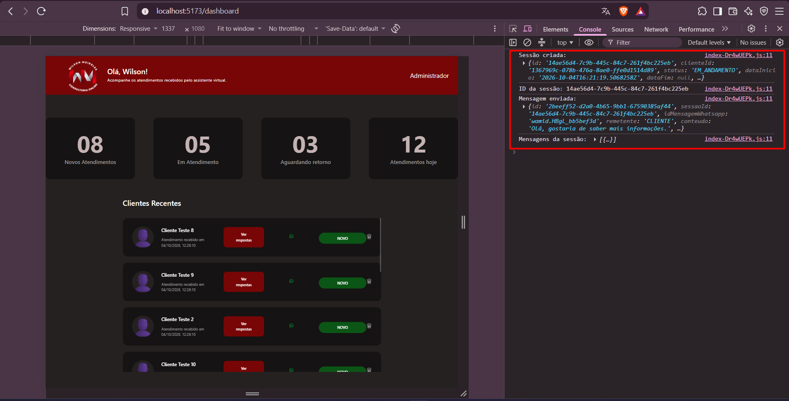

# Relatório de Testes — Issue #54

## 1. Identificação

- **Issue:** #54
- **Branch testada:** `conteinarização/fluxoderotas`
- **Commit testado:** `1525115` — `fix: correção do problema de inicialização do dockerbuild`
- **Responsável pelo desenvolvimento:** Eduardo
- **Responsável pelos testes:** QA
- **Resultado final:** ⚠️ Aprovado com ressalva — identificado defeito no recarregamento de rotas do frontend

---

## 2. Objetivo

Validar a conteinerização e o fluxo de integração entre frontend, backend e banco de dados, verificando a inicialização dos serviços via Docker, o consumo de dados do backend pelo frontend e o fluxo de criação de sessão e consulta de mensagens.

---

## 3. Escopo da validação

Foram verificados:

- Inicialização dos containers do frontend, backend e PostgreSQL;
- Execução do frontend através do container;
- Comunicação entre frontend e backend;
- Carregamento de clientes no Dashboard;
- Retorno dos dados de clientes pela API;
- Criação de sessão através do fluxo iniciado pelo frontend;
- Envio e consulta de mensagens da sessão;
- Consulta da sessão diretamente pela API;
- Comportamento das rotas do frontend após recarregamento da página.

---

## 4. Ambiente e preparação

- **Sistema operacional:** Windows
- **Docker:** Docker Desktop
- **Frontend:** React
- **Backend:** .NET
- **Banco de dados:** PostgreSQL
- **Frontend:** `localhost:5173`
- **Backend / Swagger:** `localhost:8080/swagger`

A aplicação foi executada a partir da pasta `ChatbotBackend` utilizando:

`docker compose up --build`

---

## 5. Casos de Teste

### QA-054-01 — Inicialização dos containers

**Objetivo:**  
Verificar se os serviços necessários são inicializados através do Docker Compose.

**Procedimento:**
1. Executar `docker compose up --build`.
2. Executar `docker ps`.
3. Verificar o estado dos containers.

**Resultado esperado:**  
Os containers do frontend, backend e PostgreSQL devem permanecer em execução.

**Resultado obtido:**  
Os três containers foram inicializados e permaneceram com status `Up`.

**Status:** ✅ Aprovado

**Evidência:**

---

### QA-054-02 — Execução do frontend containerizado

**Objetivo:**  
Verificar se o frontend pode ser acessado através do container e se o Dashboard é renderizado.

**Procedimento:**
1. Acessar o frontend em `localhost:5173`.
2. Navegar até o Dashboard.
3. Verificar a renderização da interface e dos clientes.

**Resultado esperado:**  
O Dashboard deve ser carregado normalmente através do frontend containerizado.

**Resultado obtido:**  
O Dashboard foi carregado corretamente e apresentou os clientes retornados pela integração.

**Status:** ✅ Aprovado

**Evidência:**

---

### QA-054-03 — Recarregamento direto da rota `/dashboard`

**Objetivo:**  
Verificar o comportamento do frontend ao recarregar diretamente uma rota gerenciada pelo React Router.

**Procedimento:**
1. Acessar o Dashboard.
2. Permanecer na rota `/dashboard`.
3. Atualizar a página utilizando `F5`.

**Resultado esperado:**  
O frontend deve permanecer na rota `/dashboard` e continuar exibindo a aplicação normalmente.

**Resultado obtido:**  
Ao atualizar diretamente a rota `/dashboard`, o nginx retornou `404 Not Found`, impedindo o carregamento da aplicação.

**Status:** ❌ Reprovado

**Evidência:**

---

### QA-054-04 — Requisição de clientes pelo frontend

**Objetivo:**  
Verificar se o frontend consegue realizar a requisição de clientes ao backend.

**Procedimento:**
1. Abrir o DevTools.
2. Acessar a aba Network.
3. Carregar o Dashboard.
4. Localizar a requisição `clientes`.
5. Verificar o retorno da requisição.

**Resultado esperado:**  
A requisição de clientes deve ser concluída com sucesso.

**Resultado obtido:**  
A requisição `clientes` foi realizada pelo frontend e retornou status `200 OK`.

**Status:** ✅ Aprovado

**Evidência:**

---

### QA-054-05 — Retorno dos clientes pelo backend

**Objetivo:**  
Verificar se os dados retornados pela API correspondem aos clientes exibidos pelo frontend.

**Procedimento:**
1. Selecionar a requisição `clientes` no Network.
2. Acessar a resposta da requisição.
3. Verificar os dados retornados.
4. Comparar com os clientes apresentados no Dashboard.

**Resultado esperado:**  
A API deve retornar os dados dos clientes e esses dados devem ser utilizados pelo frontend.

**Resultado obtido:**  
A resposta da API apresentou os clientes cadastrados, e os mesmos dados foram renderizados na lista de clientes do Dashboard.

**Status:** ✅ Aprovado

**Evidência:**

---

### QA-054-06 — Fluxo de criação de sessão e mensagem

**Objetivo:**  
Verificar o fluxo de comunicação iniciado através da ação `Ver respostas`.

**Procedimento:**
1. Abrir o Console do navegador.
2. Clicar em `Ver respostas` para um cliente.
3. Observar as operações registradas no Console.

**Resultado esperado:**  
O frontend deve conseguir iniciar o fluxo com o backend, criando uma sessão, enviando uma mensagem e consultando as mensagens da sessão.

**Resultado obtido:**  
Foram registrados no Console:
- criação da sessão;
- ID da sessão;
- envio da mensagem;
- retorno das mensagens da sessão.

O fluxo foi concluído sem erro.

**Status:** ✅ Aprovado

**Evidência:**

---

### QA-054-07 — Consulta das mensagens da sessão pela API

**Objetivo:**  
Confirmar diretamente pela API que a mensagem criada através do fluxo do frontend pode ser recuperada pelo backend.

**Procedimento:**
1. Obter o ID da sessão criada através do frontend.
2. Acessar o Swagger.
3. Executar `GET /api/Chatbot/sessoes/{sessaoId}/mensagens`.
4. Informar o ID da sessão criada.
5. Verificar a resposta.

**Resultado esperado:**  
A API deve retornar `200 OK` e apresentar a mensagem associada à sessão.

**Resultado obtido:**  
A API retornou `200 OK` e apresentou a mensagem previamente enviada pelo fluxo iniciado no frontend, confirmando a recuperação dos dados da sessão pelo backend.

**Status:** ✅ Aprovado

**Evidência:**

---

## 6. Resumo dos Resultados

- **Casos executados:** 7
- **Aprovados:** 6
- **Reprovados:** 1
- **Defeitos identificados:** 1

| Caso | Resultado |
|---|---|
| QA-054-01 | ✅ Aprovado |
| QA-054-02 | ✅ Aprovado |
| QA-054-03 | ❌ Reprovado |
| QA-054-04 | ✅ Aprovado |
| QA-054-05 | ✅ Aprovado |
| QA-054-06 | ✅ Aprovado |
| QA-054-07 | ✅ Aprovado |

---

## 7. Defeitos e Observações

### DEF-054-01 — Rota `/dashboard` retorna 404 após atualização da página

**Descrição:**  
Ao acessar normalmente o Dashboard, a aplicação funciona corretamente. Entretanto, ao atualizar a página diretamente na rota `/dashboard` utilizando `F5`, o nginx retorna `404 Not Found`.

**Impacto:**  
O usuário não consegue atualizar a página ou acessar diretamente a URL de uma rota do frontend sem receber erro.

**Severidade:** Média.

**Possível causa:**  
Configuração do nginx sem fallback das rotas da SPA para o `index.html`.

**Recomendação:**  
Revisar a configuração do nginx responsável por servir o frontend para que rotas gerenciadas pelo React Router sejam redirecionadas para o `index.html`.

---

## 8. Considerações Finais

A conteinerização permitiu a execução conjunta do frontend, backend e banco de dados, e os testes confirmaram a comunicação entre as camadas.

O frontend conseguiu consultar os clientes disponibilizados pelo backend, renderizá-los no Dashboard e iniciar o fluxo de criação de sessão e mensagem. A consulta posterior pelo Swagger também confirmou que a mensagem da sessão pôde ser recuperada pela API.

Foi identificado, entretanto, um problema no tratamento das rotas do frontend pelo nginx. Ao atualizar diretamente a rota `/dashboard`, o servidor retorna `404 Not Found`.

**Resultado final: ⚠️ Aprovado com ressalva — integração funcional, porém necessita correção do recarregamento das rotas do frontend.**
