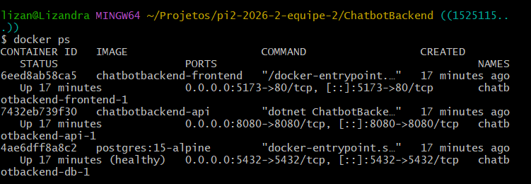
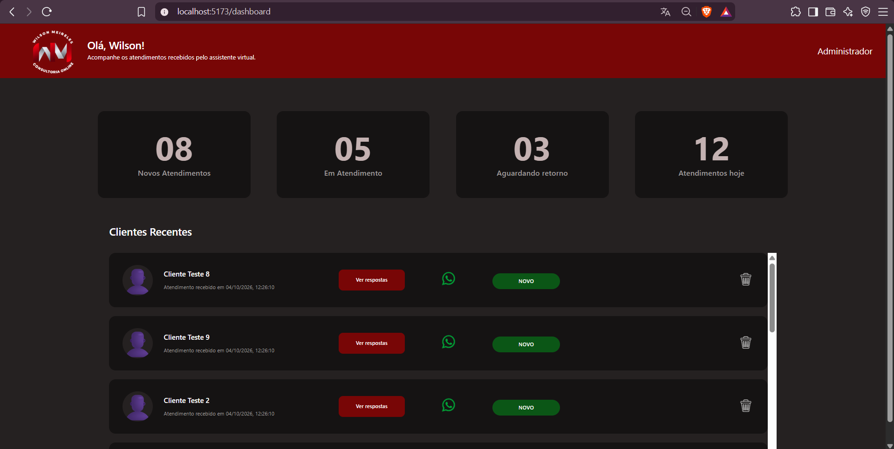
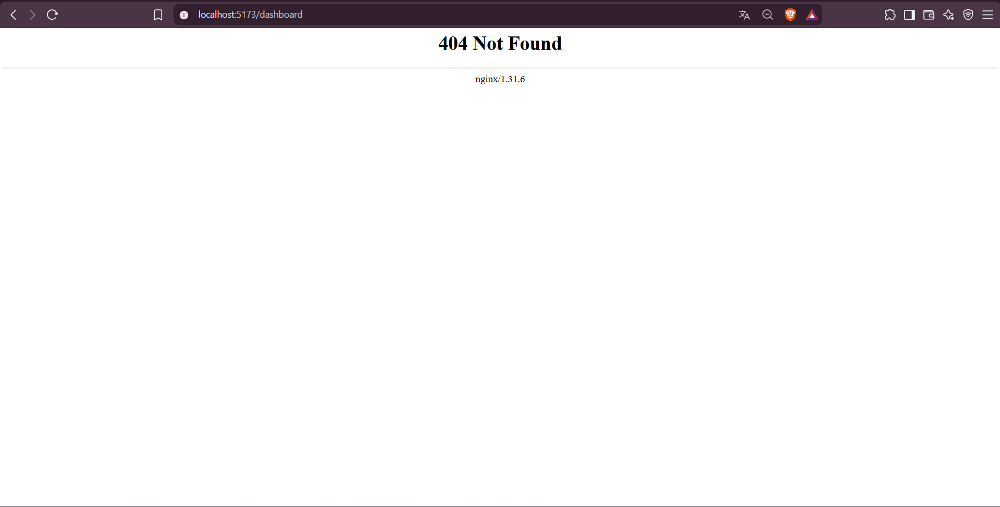

# Relatório de Testes — Issue #54

## 1. Identificação

- **Issue:** #54
- **Branch testada:** `conteinarização/fluxoderotas`
- **Commit testado:** `1525115` — `fix: correção do problema de inicialização do dockerbuild`
- **Responsável pelo desenvolvimento:** Eduardo
- **Responsável pelos testes:** QA
- **Resultado final:** ⚠️ Aprovado com ressalva — identificado defeito no recarregamento de rotas do frontend

---

## 2. Objetivo

Validar a conteinerização do frontend, backend e banco de dados, verificando a inicialização dos serviços via Docker Compose e o acesso à aplicação através dos containers.

---

## 3. Escopo da validação

Foram verificados:

- Inicialização dos containers do frontend, backend e PostgreSQL;
- Execução do frontend através do container;
- Acesso ao Dashboard através do frontend containerizado;
- Comportamento das rotas do frontend após recarregamento da página.

---

## 4. Ambiente e preparação

- **Sistema operacional:** Windows
- **Docker:** Docker Desktop
- **Frontend:** React
- **Backend:** .NET
- **Banco de dados:** PostgreSQL
- **Frontend:** `localhost:5173`
- **Backend / Swagger:** `localhost:8080/swagger`

A aplicação foi executada a partir da pasta `ChatbotBackend` utilizando:

`docker compose up --build`

---

## 5. Casos de Teste

### QA-054-01 — Inicialização dos containers

**Objetivo:**  
Verificar se os serviços necessários são inicializados através do Docker Compose.

**Procedimento:**
1. Executar `docker compose up --build`.
2. Executar `docker ps`.
3. Verificar o estado dos containers.

**Resultado esperado:**  
Os containers do frontend, backend e PostgreSQL devem permanecer em execução.

**Resultado obtido:**  
Os três containers foram inicializados e permaneceram com status `Up`.

**Status:** ✅ Aprovado

**Evidência:**

---

### QA-054-02 — Execução do frontend containerizado

**Objetivo:**  
Verificar se o frontend pode ser acessado através do container e se a aplicação é renderizada.

**Procedimento:**
1. Acessar o frontend em `localhost:5173`.
2. Navegar até o Dashboard.
3. Verificar a renderização da interface.

**Resultado esperado:**  
O Dashboard deve ser carregado normalmente através do frontend containerizado.

**Resultado obtido:**  
O frontend foi acessado através do container e o Dashboard foi renderizado corretamente.

**Status:** ✅ Aprovado

**Evidência:**

---

### QA-054-03 — Recarregamento direto da rota `/dashboard`

**Objetivo:**  
Verificar o comportamento do frontend containerizado ao recarregar diretamente uma rota gerenciada pelo React Router.

**Procedimento:**
1. Acessar o Dashboard.
2. Permanecer na rota `/dashboard`.
3. Atualizar a página utilizando `F5`.

**Resultado esperado:**  
O frontend deve permanecer na rota `/dashboard` e continuar exibindo a aplicação normalmente.

**Resultado obtido:**  
Ao atualizar diretamente a rota `/dashboard`, o nginx retornou `404 Not Found`, impedindo o carregamento da aplicação.

**Status:** ❌ Reprovado

**Evidência:**

---

## 6. Resumo dos Resultados

- **Casos executados:** 3
- **Aprovados:** 2
- **Reprovados:** 1
- **Defeitos identificados:** 1

| Caso | Resultado |
|---|---|
| QA-054-01 | ✅ Aprovado |
| QA-054-02 | ✅ Aprovado |
| QA-054-03 | ❌ Reprovado |

---

## 7. Defeitos e Observações

### DEF-054-01 — Rota `/dashboard` retorna 404 após atualização da página

**Descrição:**  
Ao acessar normalmente o Dashboard, a aplicação funciona corretamente. Entretanto, ao atualizar a página diretamente na rota `/dashboard` utilizando `F5`, o nginx retorna `404 Not Found`.

**Impacto:**  
O usuário não consegue atualizar a página ou acessar diretamente a URL de uma rota do frontend sem receber erro.

**Severidade:** Média.

**Possível causa:**  
Configuração do nginx sem fallback das rotas da SPA para o `index.html`.

**Recomendação:**  
Revisar a configuração do nginx responsável por servir o frontend para que rotas gerenciadas pelo React Router sejam redirecionadas para o `index.html`.

---

## 8. Considerações Finais

A conteinerização permitiu a inicialização conjunta dos containers do frontend, backend e banco de dados. O frontend containerizado pôde ser acessado normalmente e o Dashboard foi renderizado pela aplicação.

Foi identificado, entretanto, um problema no tratamento das rotas do frontend pelo nginx. Ao atualizar diretamente a rota `/dashboard`, o servidor retorna `404 Not Found`.

Os testes relacionados ao fluxo de comunicação entre frontend, backend e banco de dados são tratados separadamente na validação da issue #55.

**Resultado final: ⚠️ Aprovado com ressalva — a conteinerização está funcional, porém necessita correção do recarregamento das rotas do frontend.**
