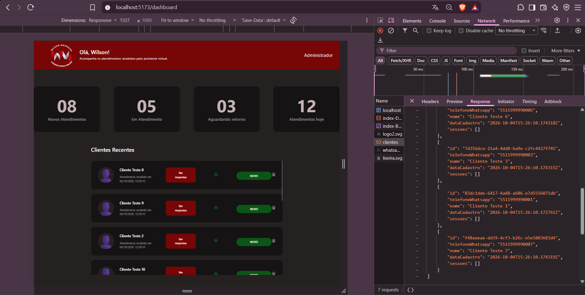
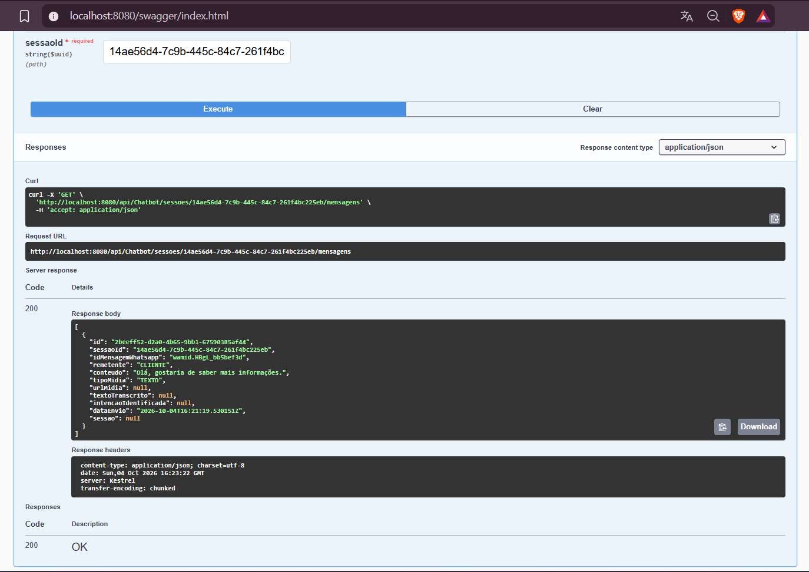

# Relatório de Testes — Issue #55

## 1. Identificação

- **Issue:** #55
- **Branch testada:** `conteinarização/fluxoderotas`
- **Commit testado:** `1525115` — `fix: correção do problema de inicialização do dockerbuild`
- **Responsável pelo desenvolvimento:** Eduardo
- **Responsável pelos testes:** QA
- **Resultado final:** ✅ Aprovado

---

## 2. Objetivo

Validar a implementação do fluxo de rotas entre frontend, backend e banco de dados, verificando se o frontend consegue realizar requisições ao backend e utilizar os dados obtidos através da integração.

---

## 3. Escopo da validação

Foram verificados dois fluxos implementados:

- Consulta de clientes pelo frontend através do backend;
- Criação de sessão, envio de mensagem e posterior consulta das mensagens da sessão.

A execução da aplicação através dos containers foi utilizada apenas como ambiente para realização dos testes e não faz parte do escopo desta validação.

---

## 4. Ambiente e preparação

- **Sistema operacional:** Windows
- **Frontend:** React
- **Backend:** .NET
- **Banco de dados:** PostgreSQL
- **Frontend:** `localhost:5173`
- **Backend / Swagger:** `localhost:8080/swagger`

A aplicação estava em execução com frontend, backend e banco de dados disponíveis para realização dos fluxos.

---

## 5. Casos de Teste

### QA-055-01 — Consulta de clientes pelo frontend

**Objetivo:**  
Verificar o fluxo de consulta de clientes realizado pelo frontend através do backend.

**Procedimento:**
1. Acessar o Dashboard.
2. Abrir o DevTools do navegador.
3. Acessar a aba Network.
4. Identificar a requisição `clientes`.
5. Verificar o status e os dados retornados pela requisição.
6. Comparar os dados retornados com os clientes apresentados no Dashboard.

**Resultado esperado:**  
O frontend deve realizar a requisição de clientes ao backend com sucesso, receber os dados e utilizá-los na interface.

**Resultado obtido:**  
A requisição `clientes` foi realizada com sucesso e retornou status `200`. A resposta apresentou os dados dos clientes, que foram utilizados na listagem exibida no Dashboard.

**Status:** ✅ Aprovado

**Evidências:**

---

### QA-055-02 — Fluxo de sessão e consulta de mensagens

**Objetivo:**  
Verificar o fluxo iniciado pelo frontend envolvendo criação de sessão, envio de mensagem e consulta das mensagens através do backend.

**Procedimento:**
1. Acessar o Dashboard.
2. Abrir o Console do navegador.
3. Clicar em `Ver respostas` para um cliente.
4. Verificar a criação da sessão e o envio da mensagem.
5. Obter o ID da sessão criada.
6. Acessar o Swagger.
7. Executar `GET /api/Chatbot/sessoes/{sessaoId}/mensagens` utilizando o ID da sessão.
8. Verificar a resposta da API.

**Resultado esperado:**  
O fluxo iniciado pelo frontend deve conseguir criar uma sessão, enviar uma mensagem e permitir que as mensagens associadas à sessão sejam posteriormente consultadas pelo backend.

**Resultado obtido:**  
O Console registrou a criação da sessão, seu identificador, o envio da mensagem e o retorno das mensagens da sessão. A consulta posterior pelo Swagger retornou status `200 OK` e apresentou a mensagem associada à sessão criada durante o fluxo.

**Status:** ✅ Aprovado

**Evidências:**

---

## 6. Resumo dos Resultados

- **Casos executados:** 2
- **Aprovados:** 2
- **Reprovados:** 0
- **Defeitos identificados:** 0

| Caso | Resultado |
|---|---|
| QA-055-01 | ✅ Aprovado |
| QA-055-02 | ✅ Aprovado |

---

## 7. Defeitos e Observações

Não foram identificados defeitos funcionais durante a validação dos dois fluxos implementados.

---

## 8. Considerações Finais

Os dois fluxos avaliados apresentaram comunicação funcional entre frontend e backend, com acesso aos dados utilizados pela aplicação.

A consulta de clientes foi realizada com sucesso e os dados retornados foram utilizados pelo Dashboard. O segundo fluxo permitiu a criação de uma sessão, o envio de uma mensagem e a posterior recuperação das mensagens associadas à sessão através da API.

**Resultado final: ✅ Aprovado — os dois fluxos avaliados funcionaram conforme esperado.**
