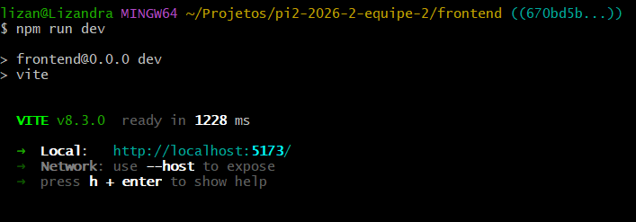
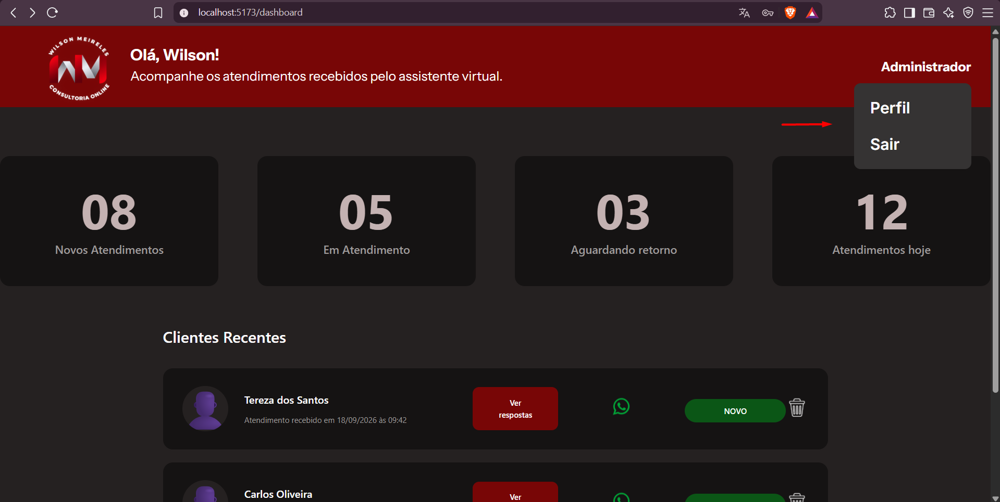
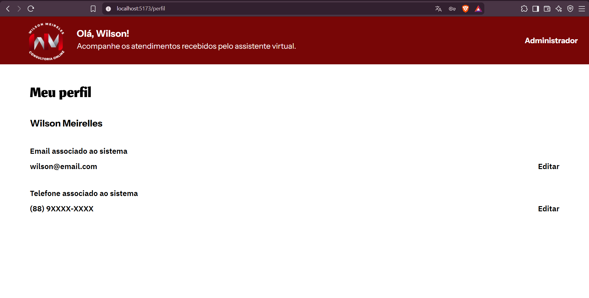
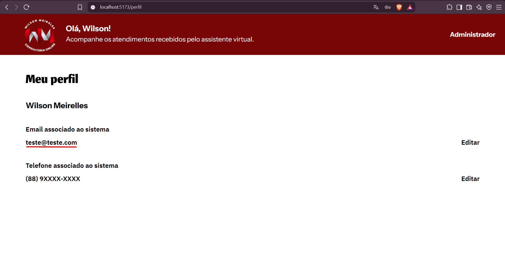
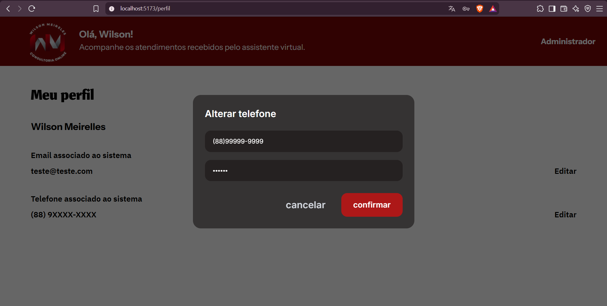
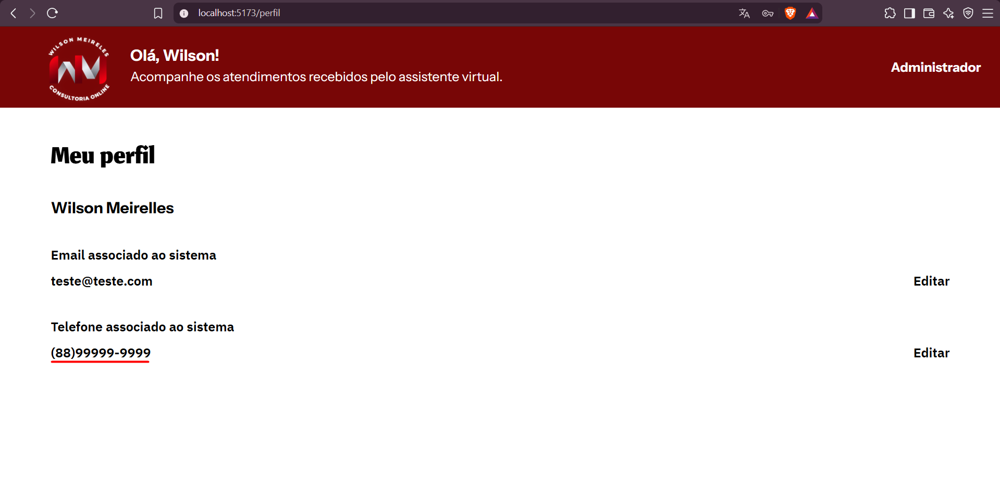
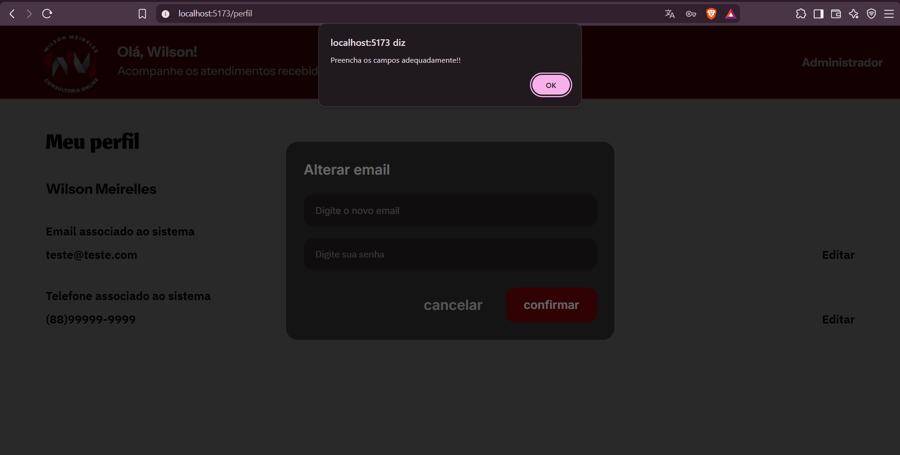
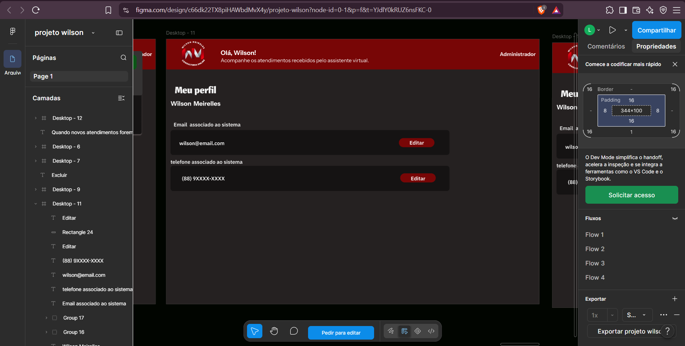
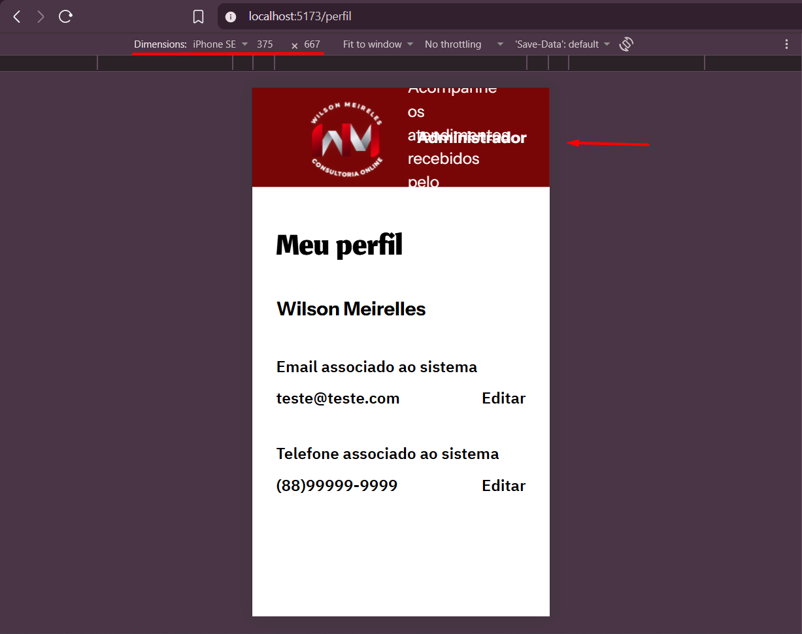

# Relatório de Testes — Issue #57

## 1. Identificação

- **Issue:** #57
- **Branch testada:** `frontend/feature-perfil-admin`
- **Commit testado:** `670bd5b` — `merge: integra main na feature de perfil`
- **Responsável pelos testes:** QA
- **Resultado final:** ❌ Reprovado — necessita correções de fidelidade visual e responsividade

---

## 2. Objetivo

Validar a implementação da área de perfil do administrador, incluindo o menu do usuário, navegação, exibição e alteração local das informações do administrador, utilização de dados mockados, modais de alteração de e-mail e telefone, validações dos formulários, fidelidade ao protótipo e comportamento da interface em diferentes tamanhos de tela.

---

## 3. Escopo da validação

Foram verificados:

- Inicialização do frontend;
- Abertura do menu do administrador;
- Exibição das opções "Perfil" e "Sair";
- Fechamento do menu ao clicar novamente em "Administrador";
- Fechamento do menu ao clicar fora;
- Navegação da opção "Perfil" para `/perfil`;
- Funcionamento da opção "Sair" e redirecionamento para `/login`;
- Exibição do nome, e-mail e telefone do administrador;
- Utilização de dados mockados;
- Independência do backend nesta etapa;
- Abertura do modal de alteração de e-mail;
- Abertura do modal de alteração de telefone;
- Campos e botões presentes nos dois modais;
- Funcionamento da opção "cancelar" nos dois modais;
- Alteração local do e-mail através da opção "confirmar";
- Alteração local do telefone através da opção "confirmar";
- Validação de campos obrigatórios;
- Fidelidade visual ao protótipo;
- Comportamento da interface em viewport mobile.

---

## 4. Ambiente e preparação

- **Sistema operacional:** Windows
- **Frontend:** React + Vite
- **Branch:** `frontend/feature-perfil-admin`
- **Commit:** `670bd5b`
- **Execução:** `npm run dev`
- **URL:** `localhost:5173`

O frontend foi iniciado através do Vite antes da execução dos testes.

---

## 5. Casos de Teste

### QA-057-01 — Inicialização do frontend

**Objetivo:**  
Verificar se o frontend inicia corretamente na branch da implementação.

**Procedimento:**
1. Acessar a pasta `frontend`.
2. Executar `npm run dev`.
3. Verificar a inicialização da aplicação.

**Resultado esperado:**  
O frontend deve iniciar sem erros impeditivos.

**Resultado obtido:**  
O Vite iniciou corretamente e disponibilizou a aplicação em `localhost:5173`.

**Status:** ✅ Aprovado

**Evidência:**

---

### QA-057-02 — Menu do administrador

**Objetivo:**  
Validar a abertura, conteúdo e fechamento do menu do administrador.

**Procedimento:**
1. Acessar o Dashboard.
2. Clicar em "Administrador".
3. Verificar as opções apresentadas.
4. Clicar novamente em "Administrador".
5. Verificar o fechamento do menu.
6. Abrir novamente o menu.
7. Clicar em uma área externa.
8. Verificar novamente o fechamento do menu.

**Resultado esperado:**  
O menu deve abrir e apresentar as opções "Perfil" e "Sair". Deve ser possível fechá-lo tanto clicando novamente em "Administrador" quanto clicando fora do menu.

**Resultado obtido:**  
O menu foi aberto corretamente e apresentou as opções "Perfil" e "Sair". O menu também pôde ser fechado tanto ao clicar novamente em "Administrador" quanto ao clicar em uma área externa.

**Status:** ✅ Aprovado

**Evidência:**

---

### QA-057-03 — Navegação e exibição da página de perfil

**Objetivo:**  
Validar a navegação para a página de perfil e a apresentação das informações do administrador.

**Procedimento:**
1. Abrir o menu "Administrador".
2. Clicar em "Perfil".
3. Verificar a URL acessada.
4. Verificar as informações apresentadas.

**Resultado esperado:**  
A aplicação deve navegar para `/perfil` e apresentar o título "Meu perfil", nome do administrador, e-mail, telefone e as respectivas ações "Editar".

**Resultado obtido:**  
A navegação para `/perfil` ocorreu corretamente. A página apresentou o título "Meu perfil", o nome Wilson Meirelles, o e-mail, o telefone e as respectivas ações "Editar".

**Status:** ✅ Aprovado

**Evidência:**

---

### QA-057-04 — Modal e alteração de e-mail

**Objetivo:**  
Validar a abertura do modal de alteração de e-mail, seus elementos, o cancelamento da operação e a confirmação de uma alteração válida.

**Procedimento:**
1. Clicar em "Editar" no e-mail.
2. Verificar o título "Alterar email".
3. Verificar o campo "Digite o novo email".
4. Verificar o campo "Digite sua senha".
5. Verificar os botões "confirmar" e "cancelar".
6. Clicar em "cancelar".
7. Verificar se o modal é fechado sem realizar alterações.
8. Abrir novamente o modal.
9. Informar `teste@email.com` e uma senha.
10. Clicar em "confirmar".
11. Verificar o e-mail apresentado na página.

**Resultado esperado:**  
O modal deve apresentar os campos e botões definidos. O botão "cancelar" deve fechar o modal sem realizar alterações. Com dados válidos, a confirmação deve realizar a alteração local implementada.

**Resultado obtido:**  
O modal apresentou corretamente o título, os campos de novo e-mail e senha e os botões "confirmar" e "cancelar". O botão "cancelar" fechou o modal corretamente sem realizar alterações. Ao preencher os campos com dados válidos e clicar em "confirmar", o e-mail exibido na página foi atualizado localmente para `teste@email.com`.

**Status:** ✅ Aprovado

**Evidências:**

---

### QA-057-05 — Modal e alteração de telefone

**Objetivo:**  
Validar a abertura do modal de alteração de telefone, seus elementos, o cancelamento da operação e a confirmação de uma alteração válida.

**Procedimento:**
1. Clicar em "Editar" no telefone.
2. Verificar o título "Alterar telefone".
3. Verificar o campo "Digite o novo telefone".
4. Verificar o campo "Digite sua senha".
5. Verificar os botões "confirmar" e "cancelar".
6. Clicar em "cancelar".
7. Verificar se o modal é fechado sem realizar alterações.
8. Abrir novamente o modal.
9. Informar `(88) 99999-9999` e uma senha.
10. Clicar em "confirmar".
11. Verificar o telefone apresentado na página.

**Resultado esperado:**  
O modal deve apresentar os campos e botões definidos. O botão "cancelar" deve fechar o modal sem realizar alterações. Com dados válidos, a confirmação deve realizar a alteração local implementada.

**Resultado obtido:**  
O modal apresentou corretamente o título, os campos de novo telefone e senha e os botões "confirmar" e "cancelar". O botão "cancelar" fechou o modal corretamente sem realizar alterações. Ao preencher os campos com dados válidos e clicar em "confirmar", o telefone exibido na página foi atualizado localmente para `(88) 99999-9999`.

**Status:** ✅ Aprovado

**Evidências:**

---

### QA-057-06 — Opção "Sair"

**Objetivo:**  
Validar o funcionamento da opção "Sair" disponível no menu do administrador.

**Procedimento:**
1. Abrir o menu "Administrador".
2. Clicar em "Sair".
3. Verificar a navegação realizada.

**Resultado esperado:**  
A sessão deve ser encerrada e o usuário deve ser redirecionado para `/login`.

**Resultado obtido:**  
A opção "Sair" funcionou corretamente e realizou o redirecionamento para `/login`.

**Status:** ✅ Aprovado

---

### QA-057-07 — Dados mockados e independência do backend

**Objetivo:**  
Verificar se a página utiliza dados mockados e não depende do backend nesta etapa.

**Procedimento:**
1. Inspecionar a implementação da página de perfil.
2. Verificar a origem do nome, e-mail e telefone.
3. Verificar a existência de chamadas a serviços ou API no componente.

**Resultado esperado:**  
Os dados utilizados no desenvolvimento inicial devem ser mockados e a página não deve depender do backend.

**Resultado obtido:**  
O nome do administrador está definido diretamente no componente. O e-mail e o telefone são armazenados em estados locais inicializados com valores mockados. Não foram identificadas chamadas ao backend no componente da página de perfil.

**Status:** ✅ Aprovado

---

### QA-057-08 — Validação de campos obrigatórios

**Objetivo:**  
Verificar o comportamento dos formulários ao tentar confirmar uma alteração sem preencher os campos obrigatórios.

**Procedimento:**
1. Abrir o modal de alteração de e-mail.
2. Manter os campos de novo e-mail e senha vazios.
3. Clicar em "confirmar".
4. Verificar o comportamento apresentado.
5. Abrir o modal de alteração de telefone.
6. Manter os campos de novo telefone e senha vazios.
7. Clicar em "confirmar".
8. Verificar o comportamento apresentado.

**Resultado esperado:**  
A aplicação deve impedir a confirmação quando os campos obrigatórios estiverem vazios e informar ao usuário que os campos precisam ser preenchidos.

**Resultado obtido:**  
A aplicação impediu a confirmação nos dois formulários e apresentou mensagem informando que os campos deveriam ser preenchidos adequadamente.

**Status:** ✅ Aprovado

**Evidência:**

---

### QA-057-09 — Fidelidade visual ao protótipo

**Objetivo:**  
Comparar a implementação da página de perfil com o layout definido no protótipo.

**Procedimento:**
1. Acessar a página `/perfil` em tamanho desktop.
2. Acessar a tela correspondente no protótipo.
3. Comparar estrutura, cores, cards e ações apresentadas.

**Resultado esperado:**  
A implementação deve apresentar layout fiel ao protótipo.

**Resultado obtido:**  
Foram identificadas diferenças visuais relevantes. No protótipo, a página utiliza fundo escuro, os dados de e-mail e telefone são apresentados em cards escuros e as ações "Editar" aparecem como botões vermelhos. Na implementação, o conteúdo utiliza fundo branco, os cards previstos não são apresentados e as ações "Editar" aparecem apenas como texto.

**Status:** ❌ Reprovado

**Evidências:**

---

### QA-057-10 — Responsividade em tela mobile

**Objetivo:**  
Verificar o comportamento da página de perfil em dispositivo móvel.

**Procedimento:**
1. Acessar `/perfil`.
2. Ativar o modo responsivo do DevTools.
3. Selecionar o viewport de iPhone SE (`375 × 667`).
4. Verificar a organização dos elementos da interface.

**Resultado esperado:**  
A página deve funcionar corretamente em diferentes tamanhos de tela, sem sobreposição ou corte inadequado dos elementos.

**Resultado obtido:**  
O conteúdo principal da página de perfil permaneceu acessível. Entretanto, o `BaseHeader` não se adaptou corretamente ao viewport mobile. A saudação e a identificação "Administrador" apresentaram sobreposição e parte do conteúdo do cabeçalho ficou cortada.

**Status:** ❌ Reprovado

**Evidência:**

---

## 6. Resumo dos Resultados

- **Casos executados:** 10
- **Aprovados:** 8
- **Reprovados:** 2
- **Defeitos identificados:** 2

| Caso | Resultado |
|---|---|
| QA-057-01 | ✅ Aprovado |
| QA-057-02 | ✅ Aprovado |
| QA-057-03 | ✅ Aprovado |
| QA-057-04 | ✅ Aprovado |
| QA-057-05 | ✅ Aprovado |
| QA-057-06 | ✅ Aprovado |
| QA-057-07 | ✅ Aprovado |
| QA-057-08 | ✅ Aprovado |
| QA-057-09 | ❌ Reprovado |
| QA-057-10 | ❌ Reprovado |

---

## 7. Defeitos e Observações

### DEF-057-01 — Layout da página de perfil divergente do protótipo

**Descrição:**  
A implementação apresenta diferenças visuais relevantes em relação ao protótipo. O protótipo utiliza fundo escuro, cards para apresentação de e-mail e telefone e botões vermelhos para a ação "Editar". Esses elementos não foram reproduzidos na implementação atual.

**Impacto:**  
O fluxo funcional permanece utilizável, porém o critério explícito de fidelidade ao protótipo não é atendido.

**Severidade:** Média.

**Recomendação:**  
Adequar cores, estrutura dos cards, botões e demais elementos visuais da página ao protótipo definido para o projeto.

---

### DEF-057-02 — Header apresenta sobreposição em tela mobile

**Descrição:**  
Em viewport de `375 × 667` (iPhone SE), os elementos do `BaseHeader` não se reorganizam adequadamente. A saudação e a identificação "Administrador" apresentam sobreposição e parte do conteúdo fica cortada.

**Impacto:**  
O conteúdo principal da página permanece acessível, porém há perda significativa de legibilidade e organização visual em dispositivos móveis.

**Severidade:** Média.

**Recomendação:**  
Ajustar o comportamento responsivo do `BaseHeader` para reorganizar seus elementos em larguras menores, evitando sobreposição e corte de conteúdo.

---

## 8. Considerações Finais

As funcionalidades principais da área de perfil do administrador foram executadas com sucesso. O menu apresentou as opções previstas, abriu corretamente e pôde ser fechado tanto através de novo clique em "Administrador" quanto através de clique fora do menu.

A navegação através da opção "Perfil" direcionou corretamente para `/perfil`, enquanto a opção "Sair" realizou o redirecionamento para `/login`.

A página apresentou corretamente o nome, e-mail e telefone do administrador utilizando dados mockados e sem dependência do backend nesta etapa.

Os modais de alteração de e-mail e telefone apresentaram os campos e botões previstos. A opção "cancelar" fechou corretamente ambos os modais sem realizar alterações. Com dados válidos, a opção "confirmar" atualizou localmente o e-mail e o telefone apresentados na página. A aplicação também impediu a confirmação quando os campos obrigatórios foram mantidos vazios.

Entretanto, foram identificadas duas não conformidades relacionadas a critérios explícitos de aceitação. A implementação apresenta diferenças visuais relevantes em relação ao protótipo e o `BaseHeader` apresenta problemas de responsividade em viewport mobile.

**Resultado final: ❌ Reprovado — necessita correções de fidelidade visual e responsividade.**
