# Relatório de Teste de Usabilidade do Protótipo

## 1. Identificação

- **Projeto:** Projeto Wilson
- **Tipo de teste:** Teste de usabilidade do protótipo
- **Ferramenta:** Figma
- **Responsável pela validação:** QA
- **Fluxos avaliados:** Flow 1, Flow 2, Flow 3 e Flow 4
- **Status final:** Aprovado com recomendações e ajustes de navegabilidade

---

## 2. Objetivo

Avaliar a usabilidade do protótipo de alta fidelidade desenvolvido no Figma, considerando a clareza das informações, facilidade de compreensão das ações disponíveis, organização dos elementos, consistência visual e facilidade de navegação pelos principais fluxos apresentados.

Durante a avaliação também foram observados problemas de navegabilidade que podem dificultar ou impedir a conclusão de determinadas ações no protótipo.

Por se tratar de um protótipo desenvolvido no Figma, a avaliação está concentrada na experiência proporcionada pelas telas e nas interações simuladas entre elas, não sendo esperado o comportamento funcional completo de uma aplicação já implementada.

---

## 3. Escopo da Avaliação

Foram avaliados os quatro flows disponibilizados no protótipo, considerando principalmente:

- clareza da tela inicial;
- compreensão das informações apresentadas no Dashboard;
- identificação das ações disponíveis nos atendimentos;
- facilidade de acesso aos detalhes de um atendimento;
- compreensão do histórico da conversa;
- compreensão do fluxo para assumir um atendimento;
- compreensão do fluxo de exclusão;
- facilidade de localização do perfil;
- compreensão das opções de edição dos dados do usuário;
- clareza das opções apresentadas em menus e modais;
- consistência visual entre as telas;
- dimensionamento, alinhamento, enquadramento e espaçamento dos componentes;
- padronização dos textos apresentados.

Durante os testes também foram registradas interações ausentes ou incompletas encontradas no protótipo.

As telas de estado de erro informadas como ainda em desenvolvimento não foram consideradas como falhas nesta avaliação.

A impossibilidade de digitar diretamente nos campos apresentados no protótipo também não foi classificada como falha, considerando que a avaliação foi realizada sobre um protótipo navegável no Figma.

---

## 4. Ambiente e Preparação

### Ambiente

- **Ferramenta:** Figma
- **Modo:** Apresentação do protótipo
- **Plataforma:** Navegador web
- **Protótipo:** Projeto Wilson

### Preparação

1. Abrir o protótipo no Figma.
2. Executar o protótipo no modo de apresentação.
3. Percorrer os quatro flows disponíveis.
4. Observar as informações e ações apresentadas em cada tela.
5. Interagir com os elementos configurados no protótipo.
6. Avaliar a compreensão dos fluxos e a organização da interface.
7. Registrar dificuldades, inconsistências e oportunidades de melhoria.

---

## 5. Avaliação de Usabilidade

### QA-USAB-01 — Clareza da tela inicial

**Objetivo:**  
Avaliar se a tela inicial apresenta de forma clara sua finalidade e a ação necessária para acessar o sistema.

**Procedimento:**  
1. Iniciar o Flow 1.
2. Observar as informações apresentadas na tela.
3. Identificar a ação principal disponível.
4. Clicar em "Acessar painel".

**Resultado esperado:**  
O usuário deve compreender que se encontra na tela de acesso ao Painel de Atendimento e identificar facilmente a ação necessária para prosseguir.

**Resultado obtido:**  
A tela apresenta de forma clara o título "Painel de Atendimento", uma breve descrição do sistema, os campos destinados ao e-mail e à senha e o botão "Acessar painel".

A ação principal possui destaque visual e sua finalidade é compreensível. Ao clicar no botão, o protótipo direciona corretamente para o Dashboard.

**Status:** ✅ Aprovado

**Evidência:**

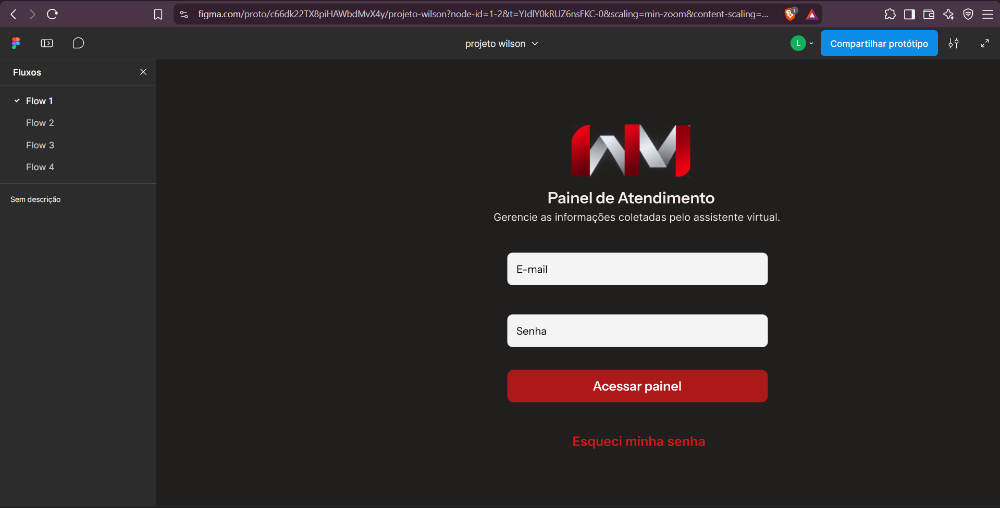

---

### QA-USAB-02 — Compreensão do Dashboard

**Objetivo:**  
Avaliar se as informações e ações apresentadas no Dashboard são compreensíveis e permitem identificar rapidamente a situação dos atendimentos.

**Procedimento:**  
1. Acessar o Dashboard.
2. Observar os indicadores apresentados.
3. Observar a seção "Clientes recentes".
4. Identificar nome, data, status e ações disponíveis em cada atendimento.

**Resultado esperado:**  
O usuário deve conseguir compreender os principais indicadores e identificar os atendimentos recentes, seus respectivos estados e as ações disponíveis.

**Resultado obtido:**  
Os cards superiores permitem identificar categorias como novos atendimentos, atendimentos em andamento, aguardando retorno e atendimentos do dia.

Na seção "Clientes recentes", os atendimentos são apresentados separadamente e possuem identificação do cliente, data, status e ações.

A utilização de cores diferentes nos status auxilia na diferenciação visual entre "NOVO", "EM ATENDIMENTO" e "FINALIZADO".

Entretanto, foram identificadas inconsistências na padronização dos nomes apresentados, além de oportunidades de melhoria no dimensionamento e organização visual da tela.

**Status:** ⚠️ Aprovado com observação

**Evidência:**

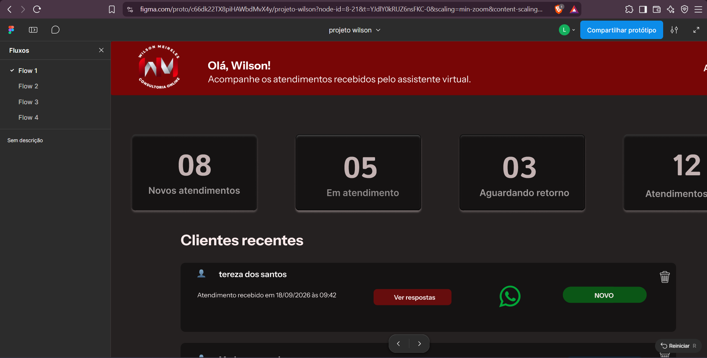

---

### QA-USAB-03 — Identificação e acesso ao detalhe do atendimento

**Objetivo:**  
Avaliar se o usuário consegue identificar facilmente como acessar as informações detalhadas de um atendimento.

**Procedimento:**  
1. Acessar a seção "Clientes recentes".
2. Identificar a ação disponível em cada atendimento.
3. Utilizar a opção "Ver respostas" no atendimento de Tereza dos Santos.
4. Retornar ao Dashboard.
5. Utilizar a mesma opção no atendimento de Mariana Sampaio.
6. Testar a mesma ação no atendimento de Adrian Moreira.

**Resultado esperado:**  
A ação necessária para consultar o atendimento deve ser facilmente identificável e apresentar comportamento consistente entre os diferentes clientes.

**Resultado obtido:**  
O botão "Ver respostas" possui destaque visual e sua finalidade é compreensível.

Entretanto, foi identificada uma inconsistência de navegabilidade: no atendimento de Tereza dos Santos, a ação direciona corretamente para a tela de detalhe. Nos atendimentos de Mariana Sampaio e Adrian Moreira, a mesma ação não apresenta interação perceptível.

A inconsistência pode gerar dúvida ao usuário, pois elementos visualmente iguais apresentam comportamentos diferentes.

**Status:** ⚠️ Aprovado com ressalva de navegabilidade

**Evidências:**

**Tereza dos Santos — acesso disponível:**

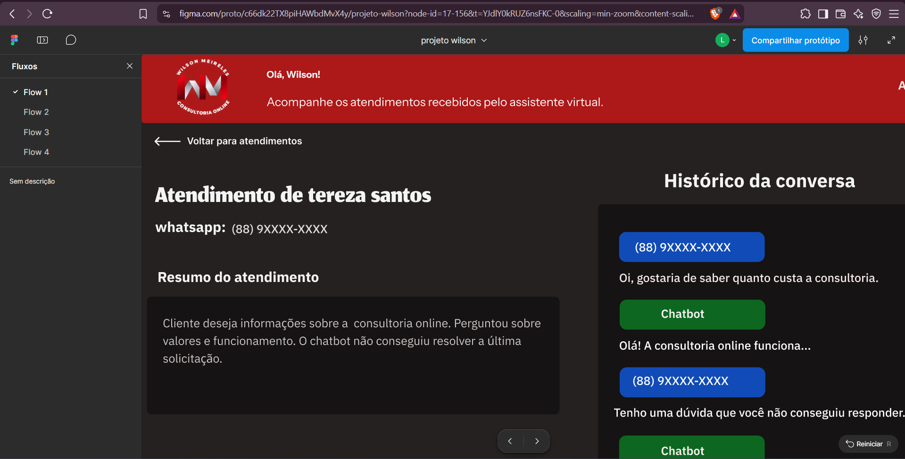

**Mariana Sampaio — ação sem navegação:**

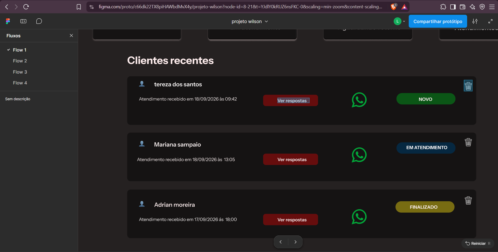

**Adrian Moreira — ação sem navegação:**

---

### QA-USAB-04 — Compreensão do detalhe do atendimento

**Objetivo:**  
Avaliar se as informações apresentadas na tela de detalhe permitem compreender facilmente o contexto e o histórico do atendimento.

**Procedimento:**  
1. Acessar o atendimento de Tereza dos Santos.
2. Observar a identificação do cliente.
3. Observar o resumo do atendimento.
4. Analisar o histórico da conversa.
5. Identificar as mensagens do cliente e do chatbot.
6. Identificar as ações disponíveis.
7. Utilizar a opção "Voltar para atendimentos".

**Resultado esperado:**  
O usuário deve conseguir identificar o cliente, compreender o motivo do atendimento, acompanhar o histórico da conversa, reconhecer as ações disponíveis e retornar facilmente à listagem.

**Resultado obtido:**  
A tela apresenta identificação do cliente, telefone, resumo do atendimento e histórico da conversa.

A separação visual entre as mensagens do cliente e do chatbot facilita a compreensão da conversa.

O texto "Atendimento encaminhado" também ajuda a comunicar a mudança do atendimento automatizado para o atendimento humano.

A ação "Assumir atendimento" possui destaque e é facilmente identificável.

A opção "Voltar para atendimentos" funcionou corretamente e permitiu retornar ao Dashboard.

**Status:** ✅ Aprovado

**Evidências:**

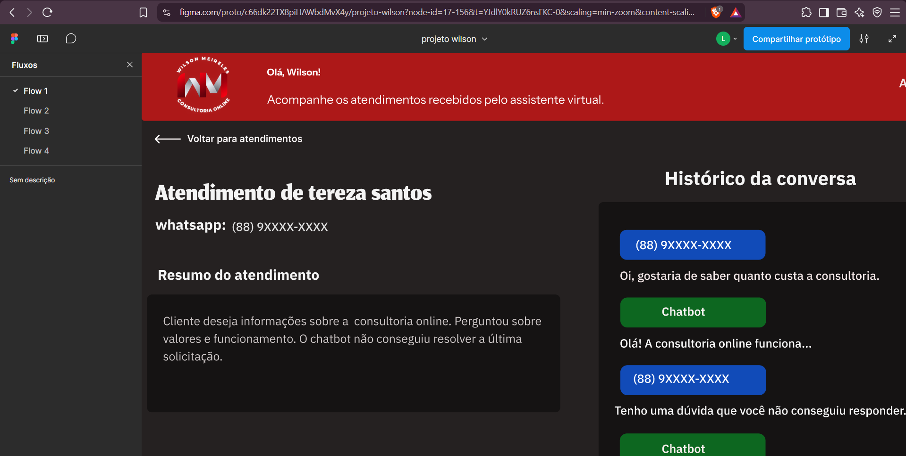

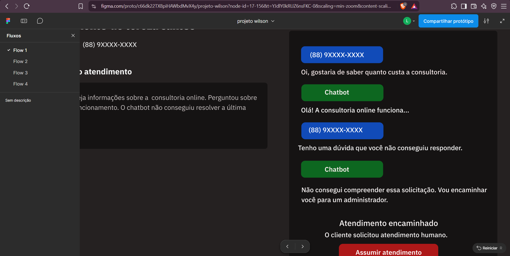

---

### QA-USAB-05 — Compreensão do fluxo para assumir atendimento

**Objetivo:**  
Avaliar se o processo para assumir um atendimento é compreensível e oferece confirmação adequada antes da ação.

**Procedimento:**  
1. Acessar o detalhe de um atendimento encaminhado.
2. Identificar a ação "Assumir atendimento".
3. Clicar na ação.
4. Observar o modal apresentado.
5. Identificar as opções disponíveis.
6. Testar as opções "Assumir atendimento" e "cancelar".
7. Repetir a validação no Flow 2.

**Resultado esperado:**  
O usuário deve compreender a ação que está prestes a realizar e possuir opções claras para confirmar ou cancelar.

**Resultado obtido:**  
O botão "Assumir atendimento" possui destaque visual adequado.

Após a interação, é apresentado um modal com o título "Assumir atendimento?" e a mensagem "Você deseja assumir o atendimento deste cliente", deixando clara a finalidade da confirmação.

As opções para confirmar e cancelar também são facilmente identificáveis.

Entretanto, durante a validação, nenhuma das duas opções apresentou interação perceptível. O mesmo comportamento foi observado nos Flows 1 e 2, impedindo a conclusão do fluxo no protótipo.

**Status:** ⚠️ Aprovado quanto à compreensão, com problema de navegabilidade

**Evidências:**

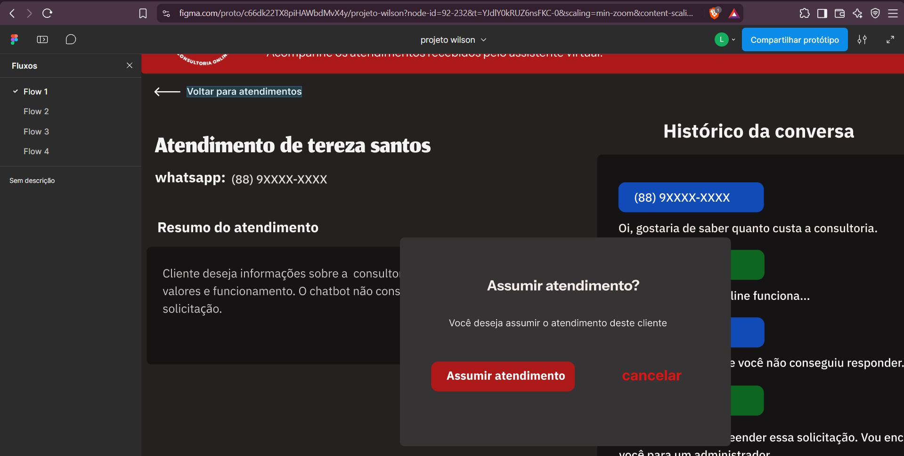

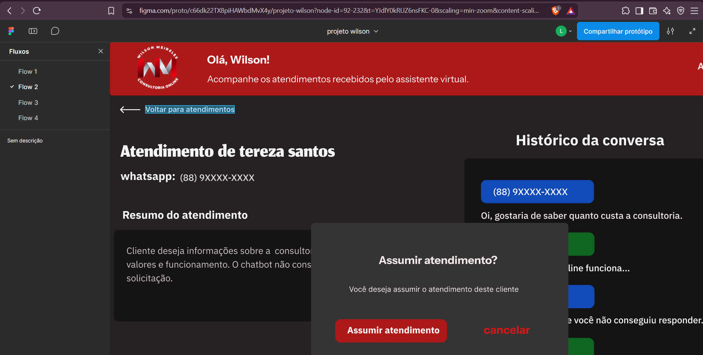

---

### QA-USAB-06 — Compreensão do fluxo de exclusão

**Objetivo:**  
Avaliar se o processo de exclusão comunica adequadamente a ação e suas consequências.

**Procedimento:**  
1. Acessar o Dashboard.
2. Clicar no ícone de exclusão de um atendimento.
3. Observar o modal apresentado.
4. Identificar as opções de confirmação e cancelamento.
5. Testar "Excluir" e "cancelar".
6. Repetir a validação no Flow 3.

**Resultado esperado:**  
O usuário deve compreender qual registro será excluído, ser informado sobre a consequência da ação e possuir alternativas claras para confirmar ou cancelar.

**Resultado obtido:**  
O protótipo apresenta um modal de confirmação identificando o cliente que será excluído e informa que a ação não poderá ser desfeita.

As opções "Excluir" e "cancelar" são visualmente identificáveis.

Entretanto, nenhuma das opções apresentou interação perceptível durante o teste. O mesmo comportamento foi observado nos Flows 1 e 3.

**Status:** ⚠️ Aprovado quanto à compreensão, com problema de navegabilidade

**Evidências:**

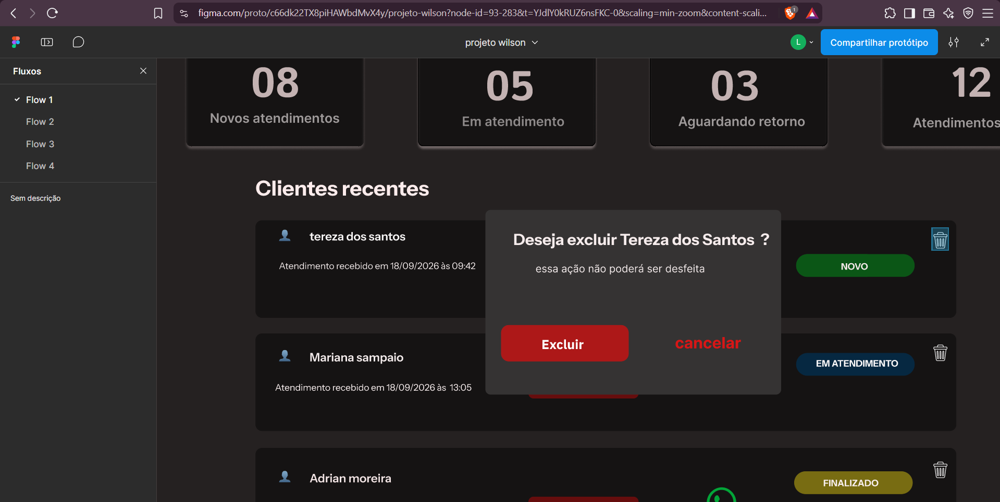

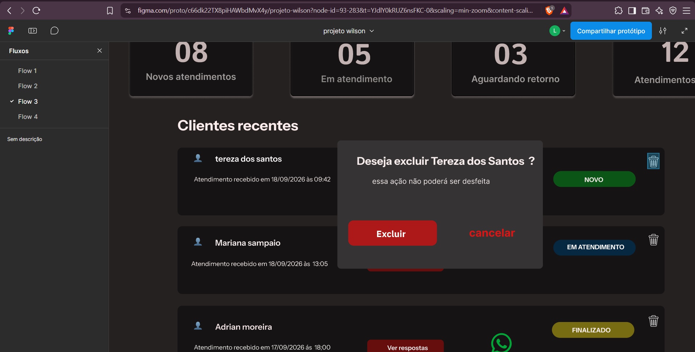

---

### QA-USAB-07 — Localização e compreensão do menu do usuário

**Objetivo:**  
Avaliar se as opções relacionadas à conta do usuário são facilmente encontradas e compreendidas.

**Procedimento:**  
1. Acessar o Flow 4.
2. Abrir o menu do usuário.
3. Observar as opções apresentadas.
4. Acessar "Perfil".
5. Retornar ao Dashboard.
6. Abrir novamente o menu do usuário.
7. Testar a opção "sair".

**Resultado esperado:**  
O usuário deve identificar facilmente as opções relacionadas à conta e compreender suas respectivas finalidades. A opção "Perfil" deve permitir o acesso aos dados do usuário e a opção "sair" deve permitir a continuidade do fluxo de saída do sistema.

**Resultado obtido:**  
O menu apresenta as opções "Perfil" e "sair", que possuem significado compreensível.

A opção "Perfil" apresenta interação e direciona corretamente para a tela "Meu perfil".

Entretanto, ao testar a opção "sair", nenhuma interação perceptível foi apresentada, impedindo a conclusão do fluxo de saída no protótipo.

**Status:** ⚠️ Aprovado com ressalva de navegabilidade

**Evidências:**

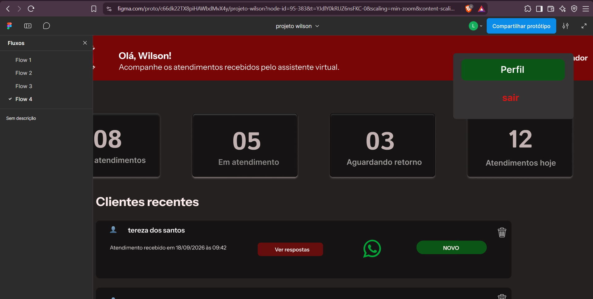

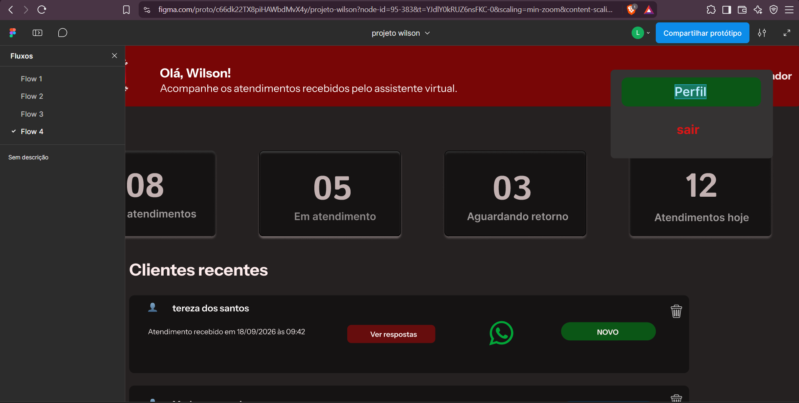

---

### QA-USAB-08 — Compreensão da edição dos dados do perfil

**Objetivo:**  
Avaliar se o usuário consegue compreender como alterar os dados associados ao seu perfil.

**Procedimento:**  
1. Acessar "Meu perfil".
2. Observar os dados apresentados.
3. Identificar as ações "Editar".
4. Clicar em "Editar" no e-mail.
5. Observar o modal apresentado.
6. Testar as ações "confirmar" e "cancelar".
7. Retornar à tela de perfil.
8. Clicar em "Editar" no telefone.
9. Observar o comportamento apresentado.

**Resultado esperado:**  
O usuário deve conseguir identificar facilmente como alterar seu e-mail e telefone e compreender as informações necessárias para realizar cada alteração.

**Resultado obtido:**  
A tela apresenta claramente o e-mail e o telefone associados ao sistema, com ações "Editar" posicionadas próximas aos respectivos dados.

Ao selecionar a edição do e-mail, é apresentado o modal "Alterar email", solicitando o novo e-mail e a senha, o que torna a finalidade da ação compreensível.

Entretanto, as opções "confirmar" e "cancelar" do modal não apresentam interação perceptível.

Ao selecionar a opção "Editar" referente ao telefone, nenhuma interação perceptível é apresentada, impossibilitando a continuidade desse fluxo no protótipo.

A impossibilidade de digitar diretamente nos campos do modal de alteração de e-mail não foi classificada como falha nesta avaliação, considerando a natureza do protótipo no Figma.

**Status:** ⚠️ Aprovado quanto à compreensão, com problemas de navegabilidade

**Evidências:**

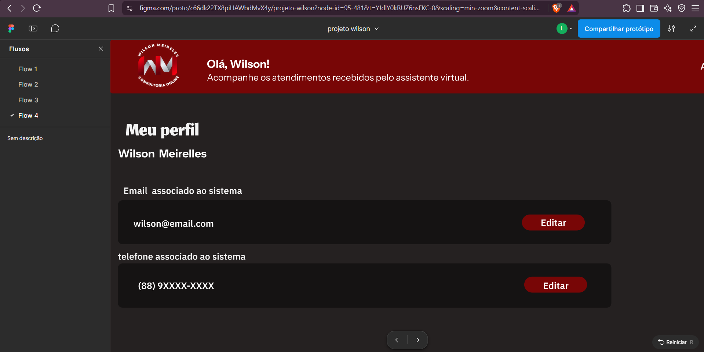

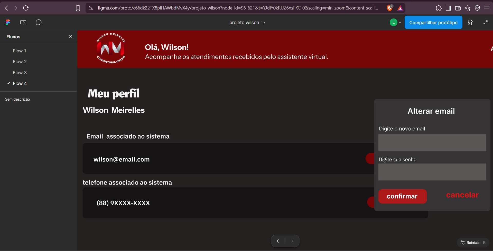

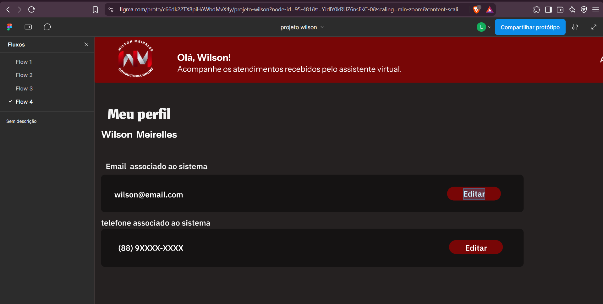

---

### QA-USAB-09 — Consistência visual da interface

**Objetivo:**  
Avaliar a consistência visual das telas do protótipo, considerando dimensionamento, alinhamento, enquadramento, espaçamento e padronização dos textos.

**Procedimento:**  
1. Percorrer as telas disponíveis nos quatro flows.
2. Observar o dimensionamento dos elementos.
3. Verificar alinhamento, posicionamento e enquadramento dos componentes.
4. Observar margens e espaçamentos.
5. Verificar a padronização dos textos.

**Resultado esperado:**  
A interface deve apresentar elementos dimensionados e posicionados de forma equilibrada, mantendo consistência visual e textual entre as diferentes telas.

**Resultado obtido:**  
A estrutura visual geral é compreensível, porém foram identificadas oportunidades de melhoria:

- alguns cards, textos, botões e espaçamentos apresentam dimensões elevadas;
- em determinadas telas, o tamanho dos elementos reduz a quantidade de conteúdo visível simultaneamente e aumenta a necessidade de rolagem;
- alguns componentes apresentam alinhamento, posicionamento ou enquadramento inconsistentes;
- foram observadas diferenças de margens e espaçamentos entre elementos;
- nomes próprios não seguem uma padronização de capitalização, como "tereza dos santos", "Mariana sampaio" e "Adrian moreira";
- ações como "cancelar", "confirmar" e "sair" aparecem com inicial minúscula, enquanto outras ações utilizam inicial maiúscula.

Esses pontos não impedem a compreensão da interface, mas reduzem sua consistência visual e podem ser aprimorados.

**Status:** ⚠️ Aprovado com observação

---

## 6. Resumo da Avaliação

Foram realizados **9 casos de avaliação de usabilidade** sobre os principais fluxos disponíveis no protótipo.

### Resultado dos casos

| Caso | Avaliação |
|---|---|
| QA-USAB-01 | ✅ Aprovado |
| QA-USAB-02 | ⚠️ Aprovado com observação |
| QA-USAB-03 | ⚠️ Aprovado com ressalva de navegabilidade |
| QA-USAB-04 | ✅ Aprovado |
| QA-USAB-05 | ⚠️ Aprovado quanto à compreensão, com problema de navegabilidade |
| QA-USAB-06 | ⚠️ Aprovado quanto à compreensão, com problema de navegabilidade |
| QA-USAB-07 | ⚠️ Aprovado com ressalva de navegabilidade |
| QA-USAB-08 | ⚠️ Aprovado quanto à compreensão, com problemas de navegabilidade |
| QA-USAB-09 | ⚠️ Aprovado com observação |

### Pontos positivos

- tela inicial com finalidade e ação principal facilmente identificáveis;
- Dashboard organizado por indicadores e atendimentos;
- utilização de status visualmente diferenciados;
- ação "Ver respostas" de fácil identificação;
- tela de detalhe apresenta contexto suficiente sobre o atendimento;
- diferenciação visual entre cliente e chatbot;
- resumo do atendimento facilita a compreensão do contexto;
- ação para assumir atendimento possui destaque;
- ações críticas apresentam confirmação antes de serem realizadas;
- opção para retornar aos atendimentos funciona corretamente;
- menu do usuário possui opções compreensíveis;
- acesso ao perfil funciona corretamente;
- dados do perfil e respectivas opções de edição são facilmente identificáveis.

### Principais pontos de melhoria

- concluir as interações de alguns fluxos do protótipo;
- manter comportamento consistente entre elementos que representam a mesma ação;
- fornecer continuidade e feedback após ações de confirmação;
- concluir os fluxos de edição de e-mail e telefone;
- concluir o fluxo de saída do sistema;
- revisar o dimensionamento de componentes;
- melhorar alinhamentos, enquadramentos e espaçamentos;
- padronizar nomes próprios e textos da interface.

---

## 7. Achados de Navegabilidade

Durante a avaliação de usabilidade foram identificados problemas de navegabilidade que não estão relacionados diretamente à compreensão da interface, mas prejudicam a execução completa das tarefas no protótipo.

### NAV-USAB-01 — "Ver respostas" apresenta comportamento inconsistente

**Descrição:**  
A ação "Ver respostas" funciona para Tereza dos Santos, porém não apresenta interação para Mariana Sampaio e Adrian Moreira.

**Impacto:** Alto.

**Sugestão:**  
Configurar a navegação dos demais atendimentos ou seus respectivos estados previstos no protótipo.

---

### NAV-USAB-02 — Confirmação de atendimento sem continuidade

**Descrição:**  
As opções "Assumir atendimento" e "cancelar" apresentadas no modal não possuem interação perceptível nos Flows 1 e 2.

**Impacto:** Alto.

**Sugestão:**  
Configurar as interações de confirmação e cancelamento e fornecer feedback após a ação.

---

### NAV-USAB-03 — Confirmação de exclusão sem continuidade

**Descrição:**  
As opções "Excluir" e "cancelar" não possuem interação perceptível nos Flows 1 e 3.

**Impacto:** Alto.

**Sugestão:**  
Configurar as interações correspondentes à confirmação e ao cancelamento.

---

### NAV-USAB-04 — Alteração de e-mail incompleta

**Descrição:**  
O modal de alteração de e-mail é apresentado, porém as opções "confirmar" e "cancelar" não possuem interação perceptível.

**Impacto:** Médio.

**Sugestão:**  
Configurar a continuidade do fluxo de alteração de e-mail, incluindo as ações de confirmação e cancelamento.

---

### NAV-USAB-05 — Alteração de telefone sem interação

**Descrição:**  
A opção "Editar" referente ao telefone não apresenta interação perceptível, impossibilitando o acesso a um fluxo de alteração do número associado ao sistema.

**Impacto:** Médio.

**Sugestão:**  
Adicionar e configurar o estado, modal ou tela correspondente à alteração do telefone.

---

### NAV-USAB-06 — Saída do sistema sem interação

**Descrição:**  
A opção "sair" não apresenta interação perceptível, impossibilitando a conclusão do fluxo de saída do sistema pelo protótipo.

**Impacto:** Médio.

**Sugestão:**  
Configurar a interação da opção "sair" e o direcionamento para o estado ou tela correspondente após a saída do sistema.

---

### OBS-USAB-01 — Ícone do WhatsApp

**Descrição:**  
O ícone do WhatsApp não apresentou interação durante a avaliação.

Não foi possível confirmar se o redirecionamento pelo WhatsApp faz parte do escopo de navegabilidade definido para o protótipo.

**Sugestão:**  
Caso represente uma ação disponível ao usuário, recomenda-se configurar a interação correspondente. Caso seja apenas um elemento representativo, nenhuma alteração é necessária para fins de navegabilidade.

---

### OBS-USAB-02 — Consistência visual da interface

**Descrição:**  
Durante a avaliação visual foram identificadas oportunidades de melhoria relacionadas ao dimensionamento, alinhamento, enquadramento, espaçamento e padronização textual dos componentes.

Alguns elementos apresentam dimensões elevadas e ocupam uma parcela significativa da área disponível. Também foram observados componentes com alinhamento ou enquadramento inconsistentes, além de diferenças de margens e espaçamentos.

Foram identificadas ainda inconsistências na capitalização dos textos, incluindo nomes próprios como "tereza dos santos", "Mariana sampaio" e "Adrian moreira", além de ações como "cancelar", "confirmar" e "sair".

**Sugestão:**  
Realizar uma revisão visual das telas buscando:

- melhor aproveitamento do espaço disponível;
- redução de elementos excessivamente grandes;
- maior consistência de alinhamento e enquadramento;
- padronização de margens e espaçamentos;
- padronização da capitalização dos textos e nomes próprios;
- maior uniformidade visual entre as diferentes telas.

---

## 8. Sugestões de Melhoria

Com base na avaliação realizada, recomenda-se:

1. Configurar as interações pendentes identificadas nos quatro flows.
2. Garantir que elementos visualmente iguais apresentem comportamentos consistentes.
3. Fornecer feedback visual após ações importantes, principalmente confirmação, exclusão e alteração de dados.
4. Configurar a navegação de "Ver respostas" para os demais atendimentos previstos no protótipo.
5. Concluir as ações de confirmação e cancelamento do fluxo "Assumir atendimento".
6. Concluir as ações de confirmação e cancelamento do fluxo de exclusão.
7. Concluir os fluxos de alteração de e-mail e telefone.
8. Configurar a opção de saída do sistema.
9. Revisar o dimensionamento de cards, textos, botões e espaçamentos para melhorar o aproveitamento da área disponível.
10. Revisar alinhamentos e enquadramentos para aumentar a uniformidade das telas.
11. Padronizar margens e espaçamentos entre componentes.
12. Padronizar a capitalização de nomes próprios e ações da interface.
13. Manter a diferenciação visual dos status dos atendimentos, pois facilita sua identificação.
14. Manter as confirmações antes de ações importantes, como assumir atendimento e excluir registros.
15. Após os ajustes, realizar nova validação dos fluxos para confirmar a continuidade da navegação.

---

## 9. Considerações Finais

O protótipo apresenta uma estrutura geral compreensível e permite identificar com facilidade as principais áreas e ações do sistema.

A tela inicial comunica adequadamente sua finalidade e apresenta uma ação principal de fácil identificação. O Dashboard permite compreender a situação geral dos atendimentos, enquanto a tela de detalhe fornece contexto sobre o cliente, resumo e histórico da conversa.

A navegação entre o Dashboard e o detalhe do atendimento de Tereza dos Santos funciona adequadamente, assim como a opção de retorno aos atendimentos. O acesso à tela de perfil também apresenta o comportamento esperado.

Os fluxos de confirmação para assumir um atendimento e excluir um registro apresentam textos que permitem compreender a ação antes de sua execução. Entretanto, as opções presentes nesses modais ainda não permitem concluir as respectivas ações no protótipo.

Também foram encontradas interações incompletas no acesso aos atendimentos de Mariana Sampaio e Adrian Moreira, na alteração de e-mail, na alteração de telefone e na opção de saída do sistema.

Além dos pontos de navegabilidade, foram identificadas oportunidades de melhoria visual relacionadas ao dimensionamento, alinhamento, enquadramento, espaçamento e padronização textual.

As telas de erro informadas como ainda em desenvolvimento não foram classificadas como problemas nesta avaliação.

Da mesma forma, a impossibilidade de digitar diretamente nos campos do protótipo não foi considerada uma falha de usabilidade por si só, considerando que a avaliação foi realizada sobre um protótipo navegável no Figma.

### Resultado final

⚠️ **Aprovado com recomendações e necessidade de ajustes de navegabilidade.**

O protótipo apresenta boa compreensão geral das principais telas e ações. Recomenda-se corrigir as interações pendentes e realizar os ajustes visuais identificados antes da próxima validação de usabilidade.
